# Smart Fitness Companion

An **AI-powered fitness application** that delivers personalized workout recommendations, intelligent progress tracking, and secure user experiences. Building it with a modern microservices architecture using React, Spring Boot, Eureka, Spring Cloud Gateway, Keycloak, RabbitMQ, PostgreSQL, and Gemini AI.

---

## Table of Contents
- [Overview](#overview)
- [Key Features (Planned)](#key-features-planned)
- [Technology Stack](#technology-stack)
- [Microservice Architecture](#microservice-architecture)
- [User Microservice](#user-microservice)
  - [Features](#features)
  - [Key Implementation Details](#key-implementation-details)
  - [API Endpoints](#api-endpoints)
  - [Request & Response DTOs](#request--response-dtos)
  - [Configuration](#configuration)
  - [Running Locally](#running-locally)
  - [Current Progress](#current-progress)
- [Activity Service](#activity-service)
  - [Features Implemented](#features-implemented)
  - [API Endpoints of Activity Service](#api-endpoints-of-activity-service)
  - [Tested Endpoints](#tested-endpoints)
  - [Technical Summary](#technical-summary)
  - [How to Test](#how-to-test)
- [Registry Service (Eureka Server)](#registry-service-eureka-server)
  - [Key Responsibilities](#key-responsibilities)
  - [Implementation Details](#implementation-details)
  - [Setup Instructions](#setup-instructions)
  - [Service Registration](#service-registration)
  - [Verification](#verification)
  - [Why Service Discovery?](#why-service-discovery)
- [Interservice Communication: User Validation](#interservice-communication-user-validation)
  - [High Level Architecture](#high-level-architecture)
  - [Components & Responsibilities](#components--responsibilities)
  - [Technology](#technology)
  - [Service Discovery & Load Balancing](#service-discovery--load-balancing)
  - [API Contract](#api-contract)
  - [Benefits & Rationale](#benefits--rationale)
- [RabbitMQ Integration For Asynchronous Event Processing](#rabbitmq-integration-for-asynchronous-event-processing)
  - [Activity Event Publishing](#activity-event-publishing)
  - [RabbitMQ Consumption - Recommendation AI Service Listener](#rabbitmq-consumption---recommendation-ai-service-listener)
  - [Current Microservice Communication Flow](#current-microservice-communication-flow)
- [AI-Powered Smart Fitness Recommendations: Microservice Integration with RabbitMQ & Gemini API](#ai-powered-smart-fitness-recommendations-microservice-integration-with-rabbitmq--gemini-api)
  - [Recommendation Service Architecture & Communication](#recommendation-service-architecture--communication)
  - [Event-Driven AI Recommendation Flow](#event-driven-ai-recommendation-flow)
  - [Gemini AI Integration](#gemini-ai-integration)
  - [Verified Endpoints](#verified-endpoints)
  - [Verified Database Entries](#verified-database-entries)
  - [How It All Works Together](#how-it-all-works-together)
  - [Key Highlights & Industry Best Practices](#key-highlights--industry-best-practices)
- [Sequence Diagram](#sequence-diagram)
- [Infrastructure Enhancements: Centralized Configuration & API Gateway](#infrastructure-enhancements-centralized-configuration--api-gateway)
  - [Centralized Configuration Management (Spring Cloud Config Server)](#centralized-configuration-management-spring-cloud-config-server)
  - [API Gateway Integration (Spring Cloud Gateway)](#api-gateway-integration-spring-cloud-gateway)
  - [Architecture Snapshot (Updated)](#architecture-snapshot-updated)
  - [Highlights](#highlights)
- [OAuth2 & Keycloak Authentication Integration](#oauth2--keycloak-authentication-integration)
  - [Why OAuth2 with Keycloak?](#why-oauth2-with-keycloak)
  - [Key Infrastructure Overview](#key-infrastructure-overview)
  - [Automatic Keycloak User Synchronization](#automatic-keycloak-user-synchronization)
  - [Token Testing via Postman](#token-testing-via-postman)
  - [Validated Scenarios](#validated-scenarios)
  - [Resulting Architecture](#resulting-architecture)


---

## Overview

Smart Fitness Companion leverages cutting-edge technologies and AI to transform the fitness journey for users. Designed with scalability, security, and personalization at its core, this platform aims to empower users to achieve their fitness goals through tailored workout plans, progress analytics, and seamless, secure access.

---

## Key Features (Planned)

- **Personalized Workouts:** AI-driven routines and recommendations using Gemini AI.
- **Progress Tracking:** Intelligent analytics to monitor improvements and suggest next steps.
- **User Security:** Enterprise-grade authentication and authorization powered by Keycloak.
- **Modern Microservices:** Each functional domain (user management, workouts, tracking, etc.) is isolated for agility and scalability.
- **Robust Communication:** Asynchronous service integration via RabbitMQ.
- **Flexible Data Storage:** Support for PostgreSQL/MySQL.
- **Service Discovery & Gateway:** Eureka and Spring Cloud Gateway for dynamic routing and service registration.
- **Web Interface:** Responsive frontend with React.

---

## Technology Stack

- **Frontend:** React (planned)
- **Backend:** Spring Boot Microservices
- **Service Discovery:** Eureka
- **API Gateway:** Spring Cloud Gateway
- **Authentication & Authorization:** Keycloak
- **Messaging:** RabbitMQ
- **Database:** PostgreSQL/MySQL
- **AI/ML:** Gemini AI (planned integration)
- **DevOps:** Docker, CI/CD pipelines (planned)

---

## Microservice Architecture

Each feature domain (users, activity etc.) is implemented as a separate microservice for scalability and maintainability. The current focus is the **user microservice**.

---

## User Microservice

### Features

- User registration and retrieval
- Role-based access via `UserRole` enum
- Secure data persistence using PostgreSQL
- RESTful API endpoints for core user operations

### Key Implementation Details

- **User entity** and **UserRole enum** defined in the domain layer.
- **Database connection** configured via `application.yml`.
- **Repository, service interface, and implementation** layers structured for clean separation of concerns.
- **UserController** exposes REST endpoints for creating and fetching users.
- **DTOs** used for request/response mapping, ensuring clean API contracts.
- **Endpoints verified** using HTTP request definitions in the `api-requests` directory.

### API Endpoints

| Method | Endpoint        | Description             |
|--------|----------------|-------------------------|
| POST   | `/register`       | Create a new user       |
| GET    | `/users/{id}`  | Retrieve user by ID     |

> See the `api-requests` directory for example HTTP requests.

### Request & Response DTOs

- **UserRequestDTO**: Used for user creation requests.
- **UserResponseDTO**: Used for user responses.


### Configuration

- Database connection settings are managed in `src/main/resources/application.yml`.


### Running Locally

1. **Clone the repository:**
   ```bash
   git clone https://github.com/PritiAryal/Smart-Fitness-Companion.git
   cd Smart-Fitness-Companion
   ```

2. **Set up PostgreSQL** and configure your credentials in `application.yml`.

3. **Build and run the user microservice:**
   ```bash
   ./mvnw spring-boot:run
   ```

4. **Test endpoints** using sample HTTP requests in the `api-requests` directory.

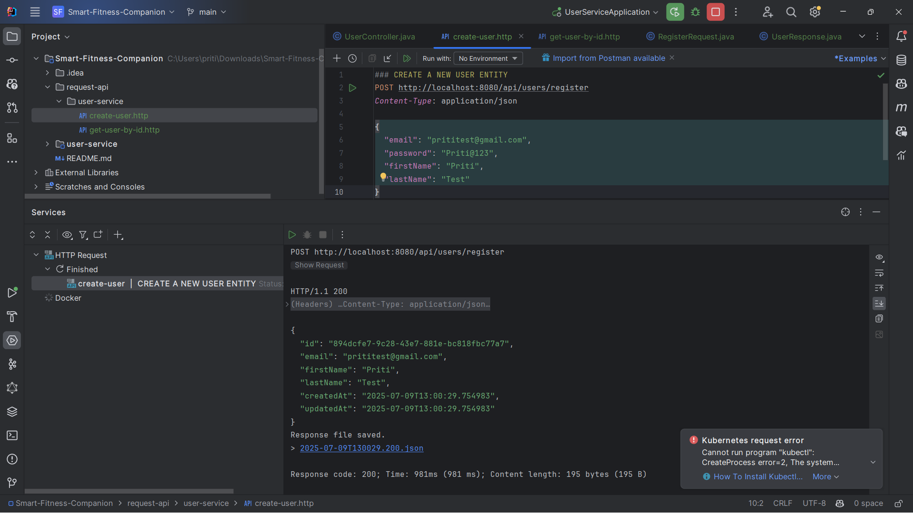
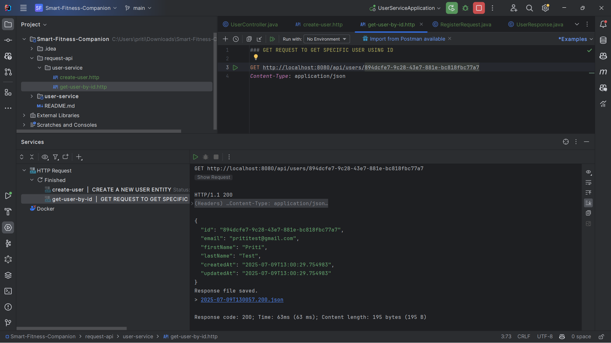
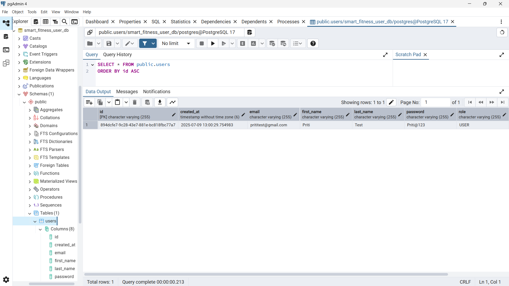


### Current Progress

The initial phase focuses on building a robust **user service** as the foundation for secure and scalable user management. This includes:

- User registration and authentication endpoints
- Integration plans for Keycloak (OAuth2)
- Data persistence with relational databases (PostgreSQL)
- Microservice-ready architecture using Spring Boot

> **Note:** Details on endpoints, usage, and deployment instructions will be included as the implementation progresses.

> The codebase is evolving; as of now, the primary focus is on the backend user service. Additional microservices and the frontend will be introduced in subsequent phases.

---

## Activity Service

The `activity-service` is a dedicated Spring Boot microservice within the Smart Fitness Companion ecosystem, responsible for recording and retrieving user activity data with a focus on scalability, maintainability, and clean architecture.

### Features Implemented

- **MongoDB Integration**: Configured via `application.yml` for flexible, document-oriented storage of activity records.
- **Activity Domain Model**:
    - Comprehensive entity representing user activity, including type, duration, calories burned, timestamps, and extensible `additionalMetrics` (e.g., distance, speed, heart rate).
- **DTO Layer**:
    - `ActivityRequestDTO` and `ActivityResponseDTO` for decoupled, validated request and response handling.
- **Repository**:
    - Spring Data MongoDB interface for efficient, type-safe data access.
- **Service Layer**:
    - Interface-driven business logic and implementation to handle activity persistence and retrieval.
- **REST Controller**:
    - Exposes APIs for activity management.
- **API Test Coverage**:
    - HTTP request test files located in `api-requests/activity-service` for endpoint verification and documentation.

### API Endpoints of Activity Service

| Method | Endpoint                        | Description                                   | Notes                          |
|--------|----------------------------------|-----------------------------------------------|--------------------------------|
| POST   | `/api/activities`                | Track a new activity                          | Requires JSON body             |
| GET    | `/api/activities`                | Retrieve all activities for a user            | Requires `X-User-Id` header    |
| GET    | `/api/activities/{activityId}`   | Retrieve a specific activity by its ID        |                                |

#### Tested Endpoints

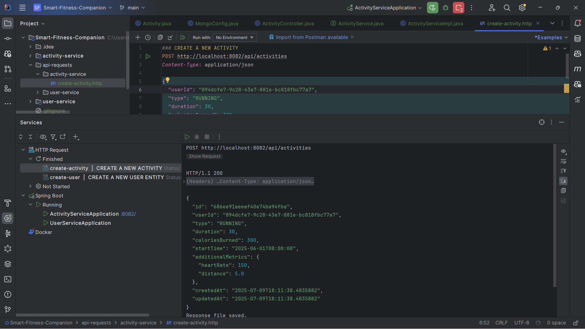
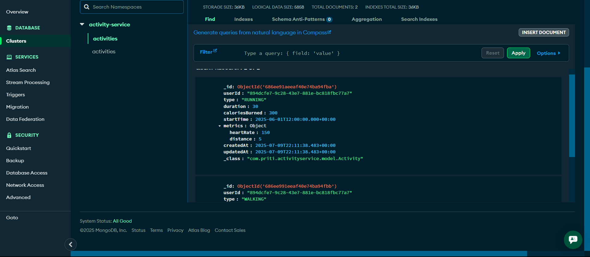
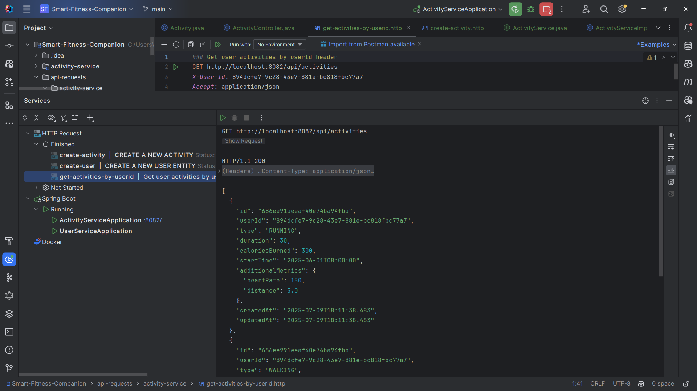
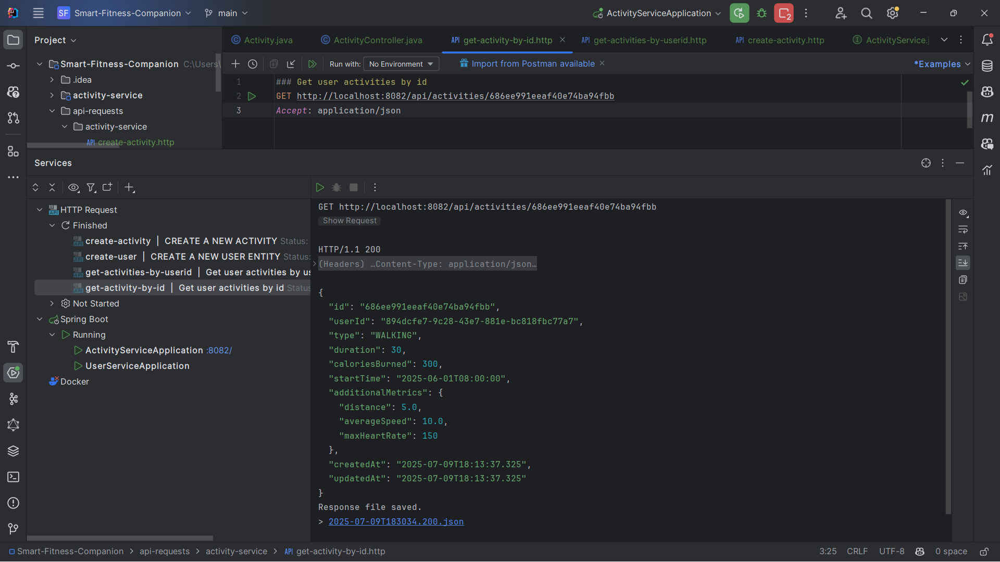

### Technical Summary

- Built with Java and Spring Boot, following industry-standard microservice practices.
- MongoDB chosen for its scalability and support for dynamic activity metrics.
- Clearly separated layers (DTO, Repository, Service, Controller) for maintainability and extensibility.
- All endpoints covered with HTTP request tests for reliability and easy onboarding.

### How to Test

- Sample HTTP requests can be found in `api-requests/activity-service`.
- Ensure MongoDB is running and configured as specified in `application.yml`.

**Note:** The activity-service is fully integrated into the Smart Fitness Companion architecture and ready for production-level use and future feature expansions.

---

## Registry Service (Eureka Server)

The Registry Service provides centralized service discovery for the Smart Fitness Companion application using Netflix Eureka. It enables microservices to register themselves at runtime and discover each other without hard-coded network locations, supporting dynamic scaling and resilience.

### Key Responsibilities

- Maintains a registry of all running microservices in the system.
- Enables client-side load balancing and fault tolerance.
- Serves as the single source of truth for service locations within the architecture.

### Implementation Details

- **Framework:** Spring Boot, Spring Cloud Netflix Eureka Server
- **Port:** 8761 (default)
- **Configuration:**
  ```yaml
  server:
    port: 8761
  eureka:
    client:
      register-with-eureka: false
      fetch-registry: false
  ```
- **Dependencies:**
  - `spring-cloud-starter-netflix-eureka-server`

### Setup Instructions

1. Ensure Java 17+ and Maven are installed.
2. Navigate to the `registry-service` directory.
3. Build and start the service:
   ```bash
   ./mvnw spring-boot:run
   ```
4. Access the Eureka dashboard at [http://localhost:8761](http://localhost:8761) to monitor registered microservices.

### Service Registration

Other microservices (such as `user-service`, `activity-service`, etc.) connect as Eureka clients by including the `spring-cloud-starter-netflix-eureka-client` dependency and configuring their `application.yml`:
```yaml
eureka:
  client:
    service-url:
      defaultZone: http://localhost:8761/eureka
```

### Verification

After startup, all properly configured client services will appear in the Eureka dashboard, confirming successful dynamic registration and discovery.

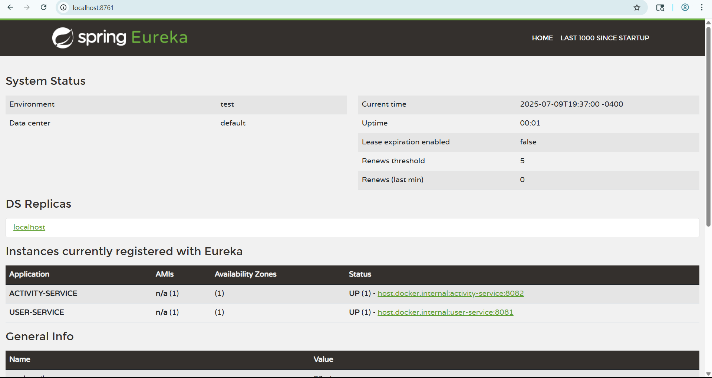

### Why Service Discovery?

Implementing a registry service using Eureka:
- Eliminates hard-coded service URLs.
- Enables robust scaling and failover strategies.
- Simplifies inter-service communication for a true microservices architecture.


## Interservice Communication: User Validation

To ensure robust data integrity and domain consistency, the Smart Fitness Companion platform implements interservice user validation between the `activity-service` and the `user-service`. This pattern enforces that all activity records are linked strictly to valid users, leveraging Spring Cloud technologies for seamless, scalable, and maintainable service interactions.

### High Level Architecture

```
[activity-service] ────► [user-service]
      |                          |
      |── WebClient Call ───────►| GET /api/users/{userId}/validate
      |                          |
   Validates userId             Returns true/false
```

- **activity-service**: Handles user activity tracking and persists records only after verifying user validity.
- **user-service**: Manages user data and exposes an endpoint for user existence validation.


### Components & Responsibilities

#### activity-service

- **UserValidationService**  
  Handles outbound REST calls to `user-service` to confirm user existence before any activity is tracked.
- **WebClientConfig**  
  Provides a load-balanced, Eureka-aware `WebClient` bean for dynamic and resilient service resolution.
- **Activity Flow Integration**  
  The `trackActivity()` method invokes user validation before persisting activities to MongoDB, ensuring only valid user records are accepted.

#### user-service

- **GET /api/users/{userId}/validate**  
  Exposes a REST API returning a boolean indicating if the user exists.
- **existByUserId() Service Method**  
  Encapsulates repository logic to efficiently check for user existence.


### Technology

| Component         | Technology                        |
|-------------------|-----------------------------------|
| Communication     | Spring WebClient                  |
| Service Discovery | Spring Cloud Netflix Eureka       |
| Validation Logic  | RESTful endpoint (Boolean return) |
| Routing           | Eureka-registered service name    |
| Data Persistence  | MongoDB (activity-service)        |


### Service Discovery & Load Balancing

- All services are registered with Eureka for automatic discovery.
- The `@LoadBalanced` WebClient distributes requests to healthy instances of `user-service`, supporting high availability and scalability.


### API Contract

**Endpoint:**  
`GET http://USER-SERVICE/api/users/{userId}/validate`

- **200 OK**: Returns `true` or `false` in the response body
- **404 Not Found**: User does not exist
- **400 Bad Request**: Malformed user ID (future-proofed for enhanced validation)

### Benefits & Rationale

- **Data Integrity:** Prevents tracking activities for nonexistent or invalid users.
- **Domain Separation:** Promotes clear service boundaries and reduces tight coupling between microservices.
- **Scalability:** Supports horizontal scaling and future enhancements (e.g., authentication, retries, async fallback).
- **Maintainability:** Centralizes integration logic, making the system easier to test and evolve.


---


## RabbitMQ Integration For Asynchronous Event Processing

**Activity Service** publishes new activity events to RabbitMQ (fitness.exchange, routing key activity.tracking) after user validation and persistence.
**Recommendation AI Service** consumes events from the activity.queue, ensuring decoupled, resilient, and scalable processing.


### Activity Event Publishing

**Service Involved**: `activity-service`

#### Dependencies and Config:

* Added `spring-boot-starter-amqp` to `pom.xml`.
* Set up `application.yml` with:

  * `fitness.exchange`
  * `activity.queue`
  * `activity.tracking` routing key

#### Configuration Class:

* Declared `Queue`, `DirectExchange`, and `Binding`.
* Enabled `Jackson2JsonMessageConverter` for automatic object <-> JSON mapping.

#### Activity Publishing:

* Modified `ActivityServiceImpl` to:

  * Validate user via `user-service`
  * Save activity to MongoDB
  * Publish the activity object to the configured RabbitMQ exchange using `RabbitTemplate`

* Created new exchange "fitness.exchange" inside RabbitMQ dashboard and then ran all services and http request file to create activity.

Published message to `fitness.exchange` using `activity.tracking` routing key
Verified message landed in `activity.queue` in RabbitMQ dashboard

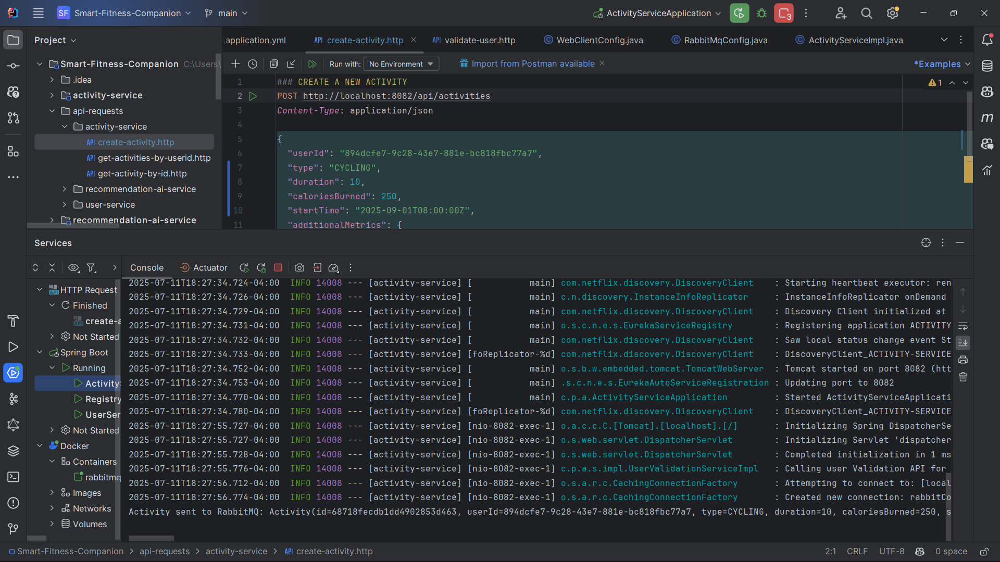

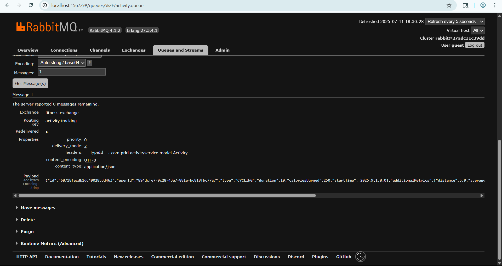


### RabbitMQ Consumption - Recommendation AI Service Listener

**Service Involved**: `recommendation-ai-service`

#### Config:

* Copied RabbitMQ config (queue, exchange, routing key) into `application.yml`
* Added same `RabbitMqConfig` class for bean setup

#### Listener Setup:

* Created `ActivityMessageListenerImpl` implementing `ActivityMessageListener`
* Added method with `@RabbitListener(queues = "${rabbitmq.queue.name}")`
* Successfully logs the received activity ID upon event receipt

Confirmed real-time consumption of activity messages from queue


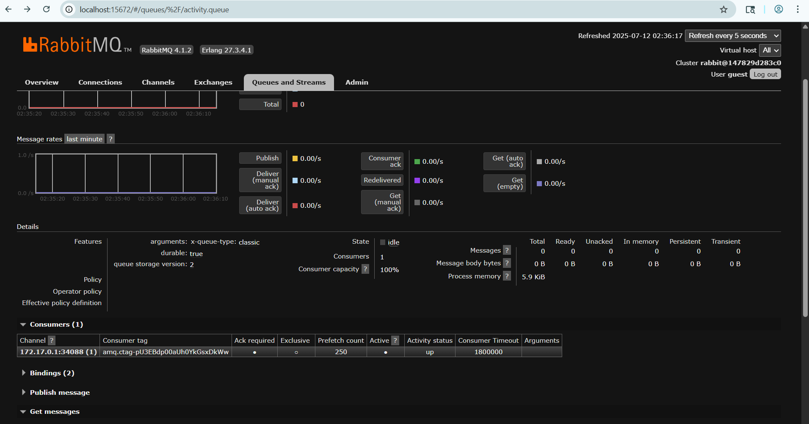
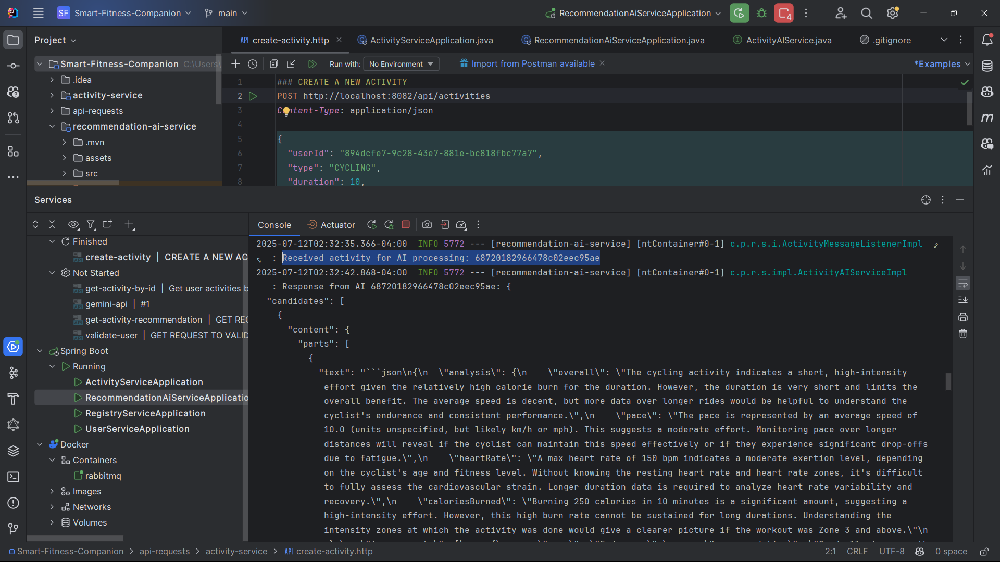


### Current Microservice Communication Flow

```plaintext
+-------------------+       REST Call       +-----------------+
|   activity-service| ─────────────────────▶|   user-service  |
|                   |  (User Validation)    |                 |
+-------------------+                       +-----------------+

        |
        | RabbitMQ Event (activity.tracking)
        ▼
+-------------------+       Message        +--------------------------+
|   activity-service| ────────────────────▶| recommendation-ai-service|
|                   |                      |  (RabbitListener)        |
+-------------------+                      +--------------------------+
```

---


## AI-Powered Smart Fitness Recommendations: Microservice Integration with RabbitMQ & Gemini API


The `recommendation-ai-service` microservice is designed to deliver intelligent, real-time fitness recommendations by leveraging a modern event-driven architecture. This service seamlessly integrates with the rest of the Smart Fitness Companion ecosystem, using RabbitMQ for asynchronous event processing and Google's Gemini AI for advanced recommendation generation.


### Recommendation Service Architecture & Communication

#### Microservice Registration & Dependencies

- **Service Registration:** Integrated as a Eureka client for service discovery and scalability.
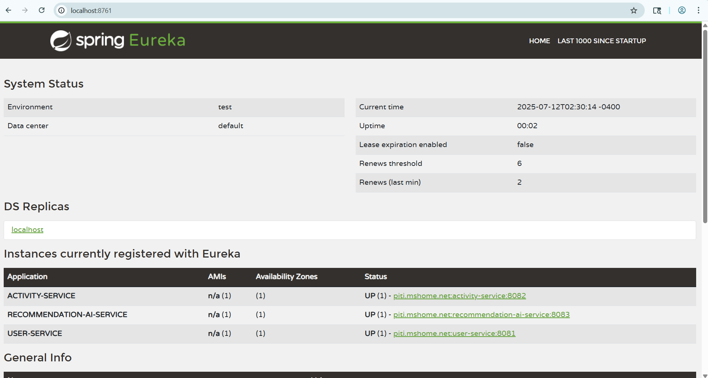

- **Dependencies:** Added support for Lombok (boilerplate reduction), MongoDB (NoSQL persistence), Spring Web, Spring WebFlux (for non-blocking Gemini API integration), and Spring Boot Starter AMQP (RabbitMQ support).

#### REST API Endpoints

Recommendation retrieval is exposed through clean, well-documented REST endpoints:

#### Data Model

All recommendations will be persisted in MongoDB with a normalized schema, enabling future analytics:

---

### Event-Driven AI Recommendation Flow

**1. Activity Creation & User Validation**

When a user logs a new activity:
- The `activity-service` validates the user.
- The activity is persisted.
- The activity object is published as a message to RabbitMQ (`fitness.exchange`, routing key: `activity.tracking`).

**2. RabbitMQ Integration**

**Activity Service** publishes new activity events to RabbitMQ (fitness.exchange, routing key activity.tracking) after user validation and persistence.
**Recommendation AI Service** consumes events from the activity.queue, ensuring decoupled, resilient, and scalable processing.

Refer to: [RabbitMQ Integration For Asynchronous Event Processing](#rabbitmq-integration-for-asynchronous-event-processing) for detailed implementation.


**3. Asynchronous Processing and AI Generation**

- The `recommendation-ai-service` listens to the `activity.queue`.
- Upon message receipt, the activity is analyzed using Google's Gemini AI. The prompt is programmatically crafted to elicit a structured, actionable response.
- The AI-generated recommendation is logged and (to-be-implemented) persisted for retrieval.


### Gemini AI Integration

#### Key Capabilities

* **Reactive Integration:** Utilizes Spring WebFlux (`WebClient`) for efficient, non-blocking HTTP requests to the Gemini API.
* **Dynamic Prompt Engineering:** Constructs tailored AI prompts based on activity type, duration, calories burned, and additional metrics.
* **Structured AI Output Parsing:** Parses Gemini’s structured JSON response via Jackson, mapping it into domain-specific recommendation entities.
* **Robust Error Handling:** Implements fallback logic to handle AI service failures or malformed responses gracefully.
* **Persistent Storage:** Persists AI-generated recommendations in **MongoDB**, associating them with users and activities.


#### Dependencies:

* Added `spring-boot-starter-webflux` to make async HTTP calls to Gemini API.

#### Config:

```yaml
gemini:
  api:
    url: ${GEMINI_API_URL}
    key: ${GEMINI_API_KEY}
```

#### Prompt Design & AI Response Format

The system generates a **precisely crafted prompt** directing Gemini to respond with JSON structured properly.

Prompt includes:

* Type, duration, calories, and additional metrics
* Instructions to return in **structured JSON format** with:

  * `recommendation`
  * `improvements`
  * `suggestions`
  * `safety`

[//]: # (```json)

[//]: # ({)

[//]: # (  "recommendation": {)

[//]: # (    "overall": "...",)

[//]: # (    "pace": "...",)

[//]: # (    "heartRate": "...",)

[//]: # (    "caloriesBurned": "...")

[//]: # (  },)

[//]: # (  "improvements": [)

[//]: # (    { "area": "...", "recommendation": "..." })

[//]: # (  ],)

[//]: # (  "suggestions": [)

[//]: # (    { "workout": "...", "description": "..." })

[//]: # (  ],)

[//]: # (  "safety": [ "...", "..." ])

[//]: # (})

[//]: # (```)

This ensures AI outputs are consistent, parseable, and immediately actionable.

#### AI Service Implementation

Created `ActivityAIServiceImpl` to:

* Builds a detailed prompt from the incoming `Activity` object.
* Calls `GeminiService` to invoke the Gemini API.
* Parses the structured AI response with Jackson’s `ObjectMapper`, extracting:

  * Performance analysis
  * Suggested improvements
  * Workout suggestions
  * Safety guidelines
* Maps the extracted data into a `Recommendation` domain entity and saves it to MongoDB.
* Includes fallback handling to generate default recommendations in case of invalid or missing AI data.


#### GeminiServiceImpl:

**Gemini API Communication**
* Uses `WebClient` to POST structured prompt to Gemini API and receive raw JSON responses.
* Blocks on `.bodyToMono(String.class).block()` for now (sync call).
* Encapsulates all external API communication. 
* Handles outgoing requests and parses responses, abstracting all Gemini API logic.
* Decouples AI API integration from business logic for maintainability and easier testing.

#### Response Parsing & Fallbacks

* Extracts AI data from nested JSON paths: `candidates[0].content.parts[0].text`.
* Cleans and parses embedded JSON strings.
* Validates presence of key nodes (`recommendation`, `improvements`, `suggestions`, `safety`).
* Provides a default recommendation object when AI response is absent or malformed.

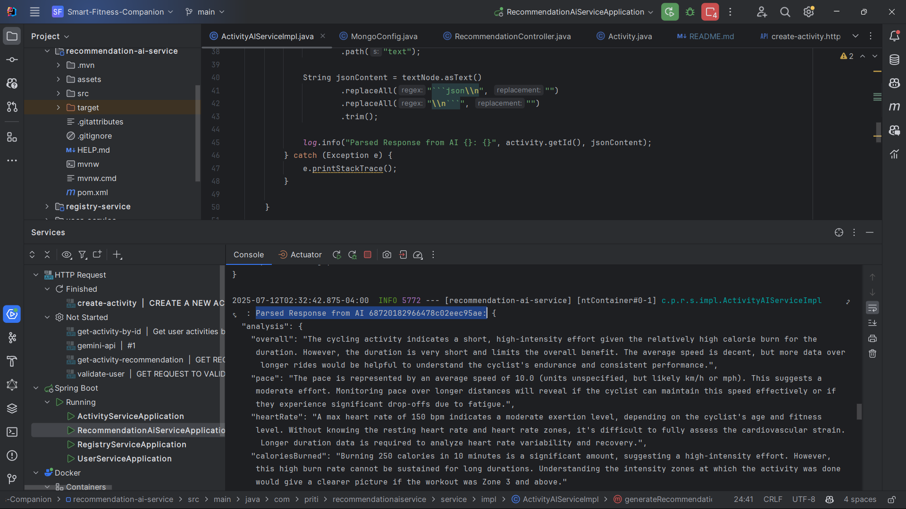


#### Listener Enhancement:

* The `ActivityMessageListenerImpl`:
  * Listens asynchronously to activity events via `@RabbitListener`.
  * Invokes AI recommendation generation on incoming activity messages `ActivityAIService.generateRecommendation(activity)`.
  * Persists generated recommendations in MongoDB.
  * Logs AI-generated JSON
  * This fully decouples the activity tracking pipeline from AI enrichment, enhancing scalability and resilience.


### Verified Endpoints

The following endpoints are tested and operational:

* `GET /api/recommendations/user/{userId}` — Fetches all recommendations for a user.
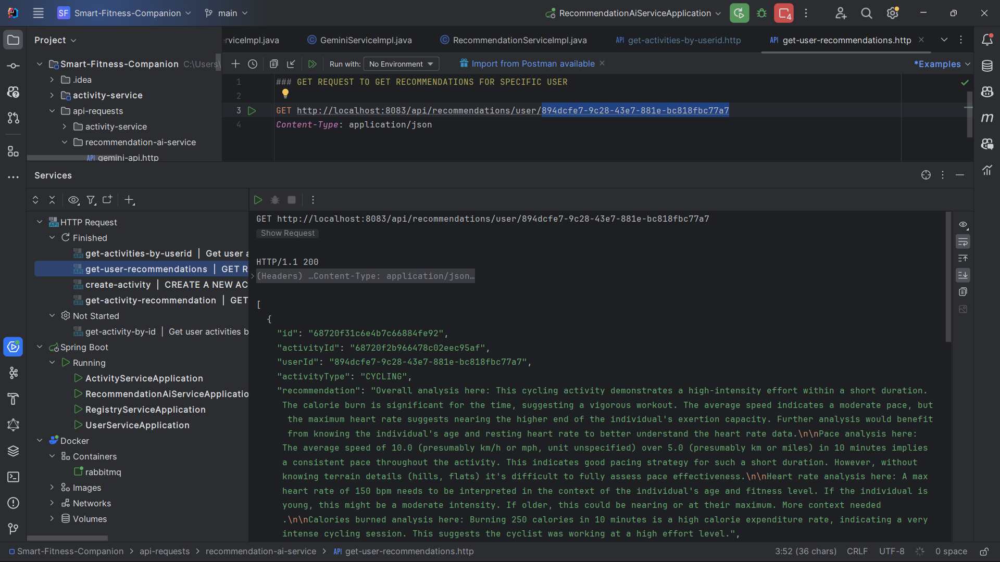

* `GET /api/recommendations/activity/{activityId}` — Retrieves the recommendation for a specific activity.
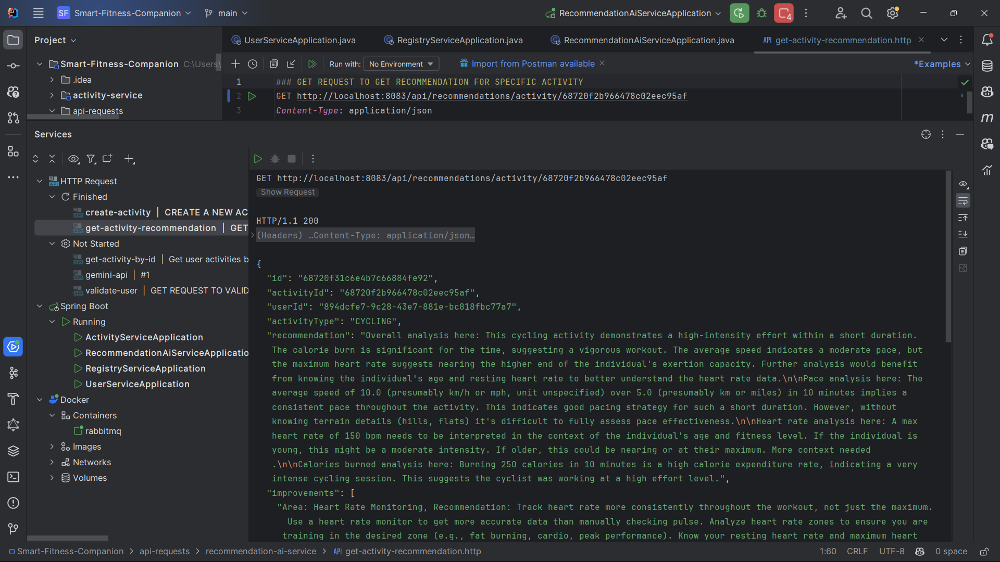

### Verified Database Entries

* Fitness Recommendations are automatically saved in MongoDB under the `recommendations` collection.
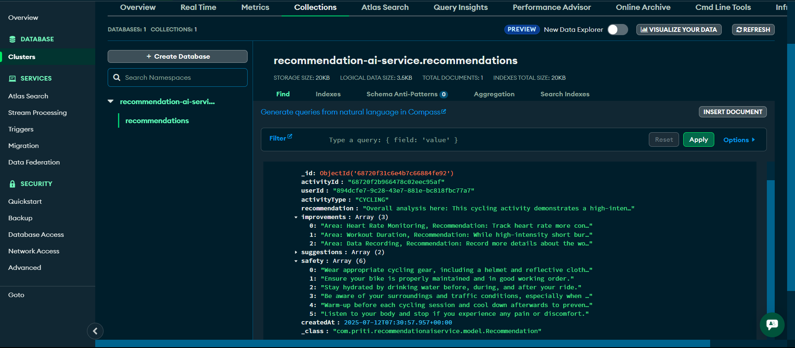

  
### How It All Works Together

1. **User logs activity** (e.g., running, cycling) via the API.
2. **User is validated** and activity is persisted.
3. **Activity is published** to RabbitMQ for downstream processing.
4. **Recommendation AI service consumes** the activity, generates a prompt, and calls Gemini API.
5. **Structured recommendation** is logged and (in progress) saved to MongoDB for future retrieval via REST endpoints.


### Flow Summary:

```plaintext
[activity-service]
  ├─ Validates user via WebClient ➜ [user-service]
  ├─ Creates activity
  └─ Publishes activity to RabbitMQ

[RabbitMQ]
  └─ Delivers event to activity.queue

[recommendation-ai-service]
  ├─ Consumes event via @RabbitListener
  ├─ Builds structured AI prompt
  ├─ Calls Gemini API via WebClient
  └─ Logs structured recommendation and saves to MongoDB
```

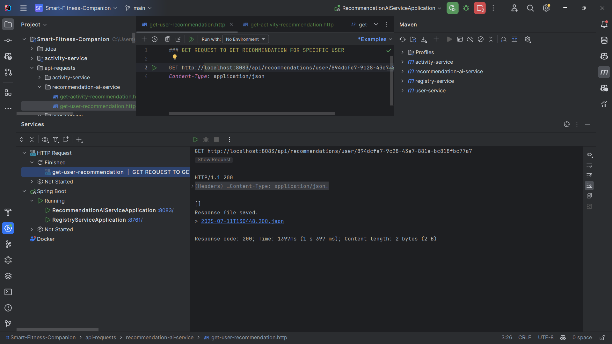
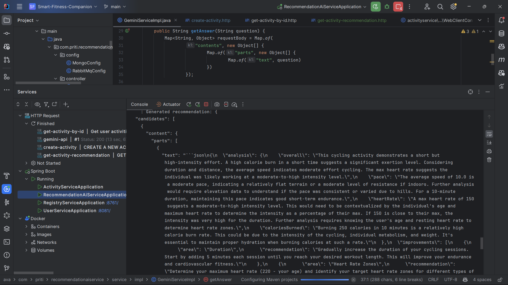


### Key Highlights & Industry Best Practices

- **Separation of Concerns:** Each microservice handles a distinct responsibility (user validation, activity tracking, recommendation).
- **Event-Driven Architecture:** Decoupling between activity tracking and recommendation processing improves scalability and resilience.
- **Cloud-Native Patterns:** Eureka for service discovery, RabbitMQ for messaging, and MongoDB for flexible data storage.
- **Modern AI Integration:** Real-time, context-aware recommendations using Google Gemini, with robust prompt engineering.
- **Security, Reliability, and Extensibility:** Production-ready setup with durable queues, validation at all stages, and easily pluggable AI modules.

**Summary:**
This integration utilizes modern microservices pattern combining event-driven architecture, reactive AI calls, robust JSON parsing, and persistence — delivering a scalable, maintainable, and AI-enhanced fitness application.


---


## Sequence Diagram

**In Progress:**

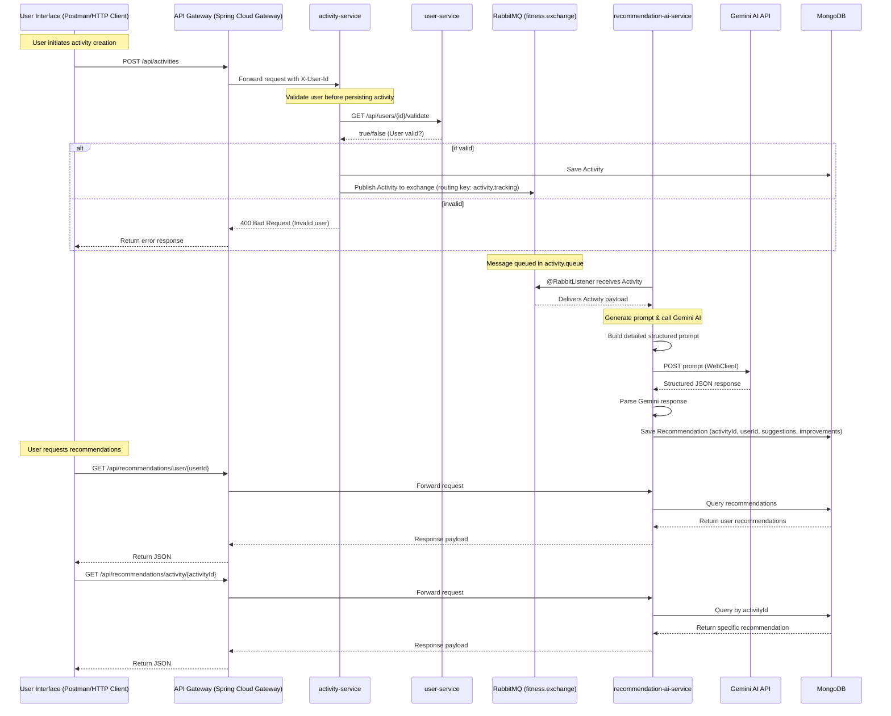
```mermaid
sequenceDiagram
    participant UI as User Interface (Postman/HTTP Client)
    participant Gateway as API Gateway (Spring Cloud Gateway)
    participant ActivitySvc as activity-service
    participant UserSvc as user-service
    participant MQ as RabbitMQ (fitness.exchange)
    participant AISvc as recommendation-ai-service
    participant Gemini as Gemini AI API
    participant Mongo as MongoDB

    Note over UI: User initiates activity creation
    UI->>Gateway: POST /api/activities
    Gateway->>ActivitySvc: Forward request with X-User-Id

    Note over ActivitySvc: Validate user before persisting activity
    ActivitySvc->>UserSvc: GET /api/users/{id}/validate
    UserSvc-->>ActivitySvc: true/false (User valid?)

    alt if valid
        ActivitySvc->>Mongo: Save Activity
        ActivitySvc->>MQ: Publish Activity to exchange (routing key: activity.tracking)
    else invalid
        ActivitySvc-->>Gateway: 400 Bad Request (Invalid user)
        Gateway-->>UI: Return error response
    end

    Note over MQ: Message queued in activity.queue

    AISvc->>MQ: @RabbitListener receives Activity
    MQ-->>AISvc: Delivers Activity payload

    Note over AISvc: Generate prompt & call Gemini AI
    AISvc->>AISvc: Build detailed structured prompt
    AISvc->>Gemini: POST prompt (WebClient)
    Gemini-->>AISvc: Structured JSON response

    AISvc->>AISvc: Parse Gemini response
    AISvc->>Mongo: Save Recommendation (activityId, userId, suggestions, improvements)

    Note over UI: User requests recommendations
    UI->>Gateway: GET /api/recommendations/user/{userId}
    Gateway->>AISvc: Forward request
    AISvc->>Mongo: Query recommendations
    Mongo-->>AISvc: Return user recommendations
    AISvc-->>Gateway: Response payload
    Gateway-->>UI: Return JSON

    UI->>Gateway: GET /api/recommendations/activity/{activityId}
    Gateway->>AISvc: Forward request
    AISvc->>Mongo: Query by activityId
    Mongo-->>AISvc: Return specific recommendation
    AISvc-->>Gateway: Response payload
    Gateway-->>UI: Return JSON
```

---

## Infrastructure Enhancements: Centralized Configuration & API Gateway

To support **scalable microservices**, reduce duplication, and adhere to **separation of concerns**, introducing two critical infrastructure upgrades:

1. **Centralized Configuration** via Spring Cloud Config Server
2. **Intelligent API Gateway Routing** via Spring Cloud Gateway


### Centralized Configuration Management (Spring Cloud Config Server)

We replaced decentralized configuration files with a **centralized config server**, enabling all microservices to dynamically load their settings at runtime from a unified source.

#### Module Created

* **Module Name:** `config-service`
* **Tech Stack:** Java 24, Spring Boot 3.5.3
* **Dependency:** `spring-cloud-config-server`

#### Configuration Process

1. **Migrated all individual configs** (`application.yml` from:

    * `user-service`
    * `activity-service`
    * `recommendation-ai-service`
    * `api-gateway`
      into a central config folder within config-service

2. **Enabled Native File-Based Config Repo**
   Updated `config-service`'s own `application.yml` to make it happen.


3. **Enabled Config Server in Main App:**
   Annotated main class with:

   ```java
   @EnableConfigServer
   ```

4. **Updated Config Clients** (`user-service`, `activity-service`, `recommendation-ai-service`, `api-gateway`) by:

    * Adding `spring-cloud-starter-config` dependency.
    * Removing hardcoded configs and connecting them to the centralized config server.
    * Enabling dynamic config loading via the Spring Cloud Config Client dependency and URL-based import strategy.

5. **Verification:**

Verified each service’s configuration by running all services and hitting the config server endpoints.

* Confirmed via running all services and also check endpoints like:

    * `http://localhost:8888/activity-service/default`

    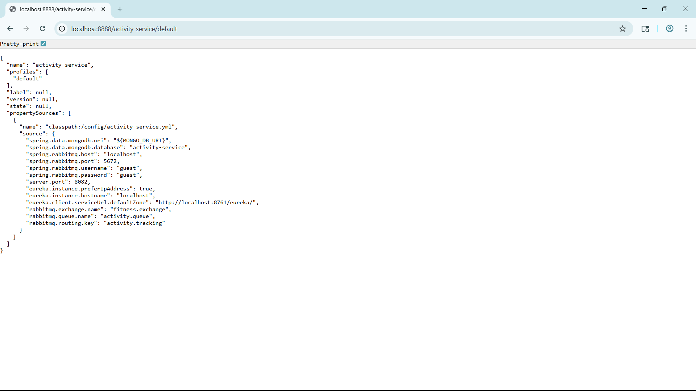

#### Benefits:

* Centralized, version-controlled configuration management.
* Environment profile support (`dev`, `prod`, `staging`).
* Eliminates redundancy and improves maintainability.
* Instant config updates without code changes (when externalized to Git in future).


### API Gateway Integration (Spring Cloud Gateway)

We implemented an **API Gateway** to serve as the unified entry point for all internal microservices. This streamlines external client communication and supports dynamic routing, monitoring, and future security layers.

#### Module Created

* **Module Name:** `api-gateway`
* **Tech Stack:** Java 24, Spring Boot 3.5.3
* **Dependencies:**

    * `spring-cloud-starter-gateway`
    * `spring-cloud-starter-netflix-eureka-client`

#### Central Routing Configuration

* Defined logical routes for all backend microservices (user-service, activity-service, recommendation-ai-service) with appropriate path patterns.
* Registered the API Gateway with Eureka for automatic service discovery.
* Externalized the gateway configuration to the config-service like all other services.


> All microservices are discoverable via Eureka. Gateway routes use **service names** and **load-balanced URIs** (`lb://`) for resiliency.

#### Verified Functionality:

* Gateway successfully routes requests to internal services via:

    * `http://localhost:8080/api/users/**`
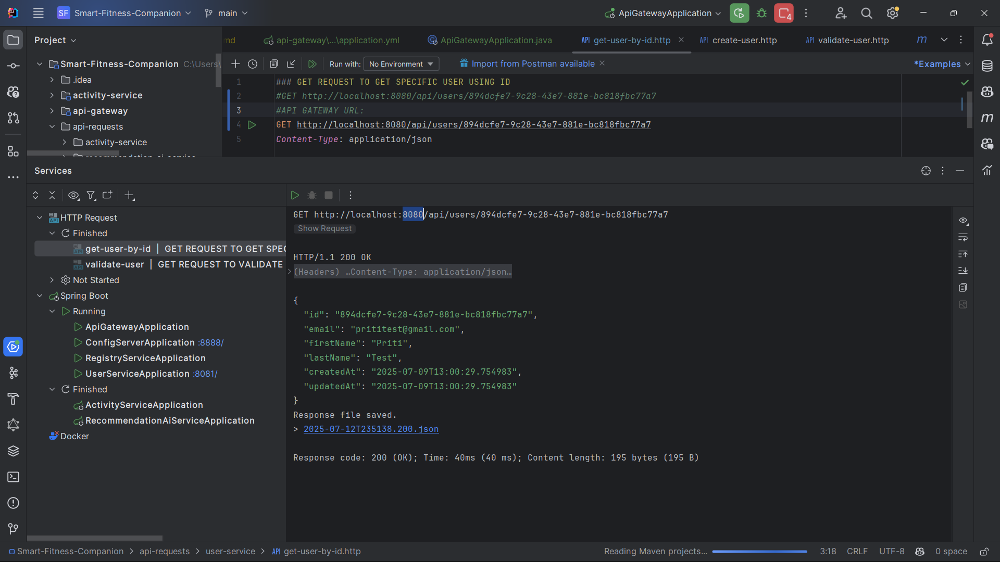

    * `http://localhost:8080/api/activities/**`
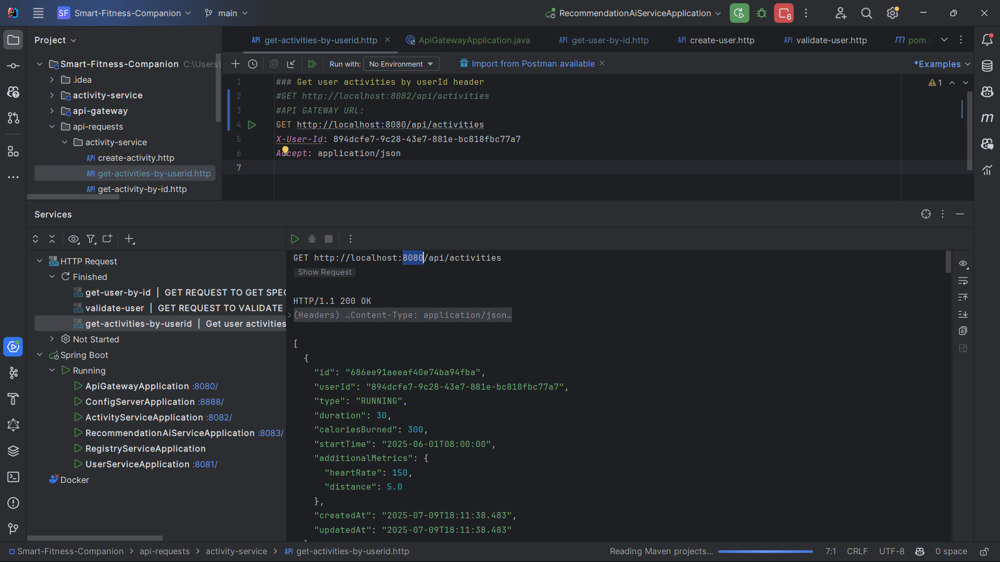

    * `http://localhost:8080/api/recommendations/**`
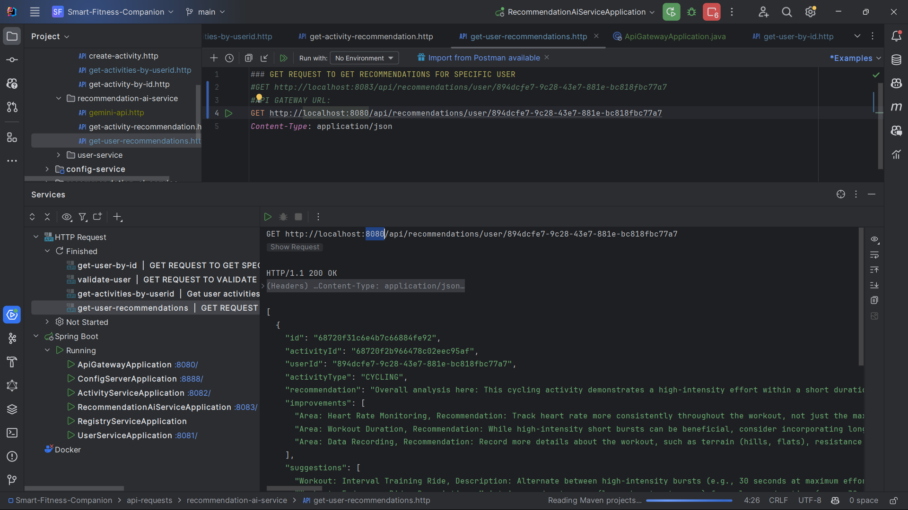

* All routes and services registered with Eureka and visible on dashboard.


### Architecture Snapshot (Updated)

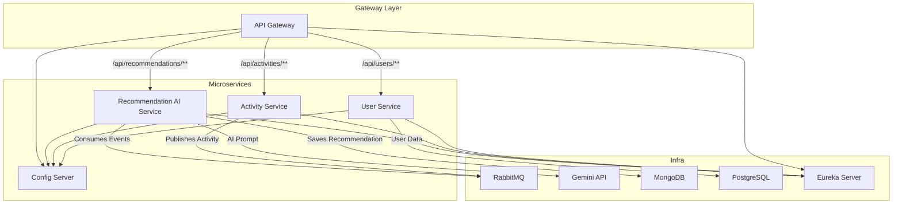
```mermaid
graph TD
  subgraph Gateway Layer
    AG[API Gateway]
  end

  subgraph Microservices
    US[User Service]
    AS[Activity Service]
    RS[Recommendation AI Service]
    CFG[Config Server]
  end

  subgraph Infra
    RMQ[RabbitMQ]
    GEM[Gemini API]
    MONGO[MongoDB]
    POSTGRESQL[PostgreSQL]
    EUREKA[Eureka Server]
  end

  AG -->|/api/users/**| US
  AG -->|/api/activities/**| AS
  AG -->|/api/recommendations/**| RS

  US --> CFG
  AS --> CFG
  RS --> CFG
  AG --> CFG

  US --> EUREKA
  AS --> EUREKA
  RS --> EUREKA
  AG --> EUREKA

  AS -->|Publishes Activity| RMQ
  RS -->|Consumes Events| RMQ
  RS -->|AI Prompt| GEM
  RS -->|Saves Recommendation| MONGO
  US -->|User Data| POSTGRESQL
```

### Highlights

* **Spring Cloud Config** for centralized and scalable configuration management.
* **Spring Cloud Gateway** for unified ingress routing.
* **Microservices + Eureka** architecture for service discovery and modularity.
* **Fully environment-configurable**, dynamic and production-aligned infrastructure.


---

### OAuth2 & Keycloak Authentication Integration

The Smart Fitness Companion now supports secure authentication and authorization using **Keycloak** with **OAuth2 Authorization Code Flow + PKCE**.

---

### Why OAuth2 with Keycloak?

Centralized identity and access management
Scalable and stateless token-based security
Authorization Code Flow with PKCE for secure SPA support
Microservices remain decoupled from authentication logic
Supports SSO, token revocation, user federation

---

### Key Infrastructure Overview

#### Keycloak Setup

* **Containerized** using Docker image: `quay.io/keycloak/keycloak:26.3.1`
* Realm: `fitness-oauth2`
* Public client: `oauth2-pkce-client`

  * Enabled `Authorization Code Flow`
  * Enabled `PKCE` (S256)
  * Configured Redirect URIs: `http://localhost:5173` (future frontend)

#### API Gateway Security Configuration

* Dependency: `spring-boot-starter-oauth2-resource-server`
* JWKS URI fetched from:
  `http://localhost:8181/realms/fitness-oauth2/.well-known/openid-configuration`
* Security logic defined in `SecurityConfig.java`

  * Enforces `.oauth2ResourceServer().jwt()`
  * All routes protected; CSRF disabled


### Automatic Keycloak User Synchronization

When an authenticated request comes through API Gateway:

1. **JWT Token Intercepted**

  * A `KeycloakUserSyncFilter` reads the JWT token.
  * Extracts claims: `sub` (Keycloak ID), `email`, `given_name`, `family_name`

2. **User Validation**

  * Gateway calls `GET /api/users/{keycloakId}/validate`
  * If the user does **not exist** in DB (checked by `keycloakId`), then:

3. **User Registration**

  * Gateway calls `POST /api/users/register`
  * Sends extracted details to create user
  * Ensures local DB contains every Keycloak-authenticated user

4. **Header Mutation**

  * Adds `X-User-ID` to headers for downstream services

---

#### Keycloak to Local DB Sync

Every authenticated request passes through the API Gateway's `KeycloakUserSyncFilter`:

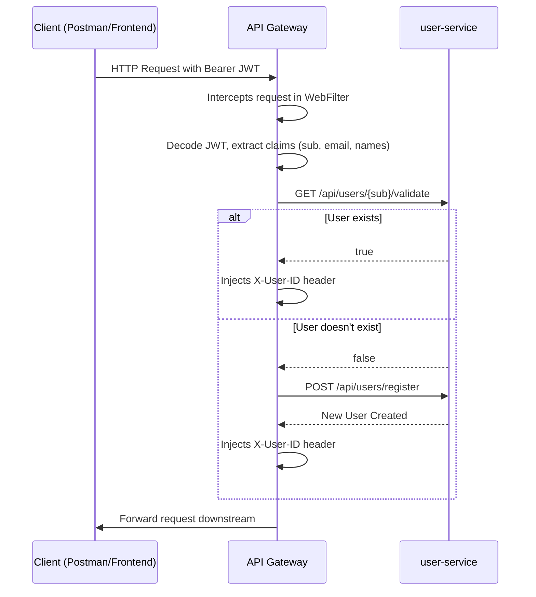
```mermaid
sequenceDiagram
    participant Client as Client (Postman/Frontend)
    participant Gateway as API Gateway
    participant UserSvc as user-service

    Client->>Gateway: HTTP Request with Bearer JWT
    Gateway->>Gateway: Intercepts request in WebFilter
    Gateway->>Gateway: Decode JWT, extract claims (sub, email, names)
    Gateway->>UserSvc: GET /api/users/{sub}/validate
    alt User exists
        UserSvc-->>Gateway: true
        Gateway->>Gateway: Injects X-User-ID header
    else User doesn't exist
        UserSvc-->>Gateway: false
        Gateway->>UserSvc: POST /api/users/register
        UserSvc-->>Gateway: New User Created
        Gateway->>Gateway: Injects X-User-ID header
    end
    Gateway->>Client: Forward request downstream
```

#### Extracted JWT Claims

* `sub` → Keycloak ID (used as primary reference)
* `email`, `given_name`, `family_name`
* Dummy password is set on initial sync

#### Header Injection

* Gateway adds `X-User-ID` to requests
* Downstream services use this to identify current user


### Token Testing via Postman

1. Use `oauth2-pkce-client` with `Authorization Code` + PKCE (S256)
2. Use Keycloak's discovery endpoint to get metadata and tokens
3. Set:

  * Auth URL
  * Token URL
4. After login, copy **access token** and pass in `Authorization: Bearer <token>` header

Test:

* `GET /api/users/{userId}/validate`

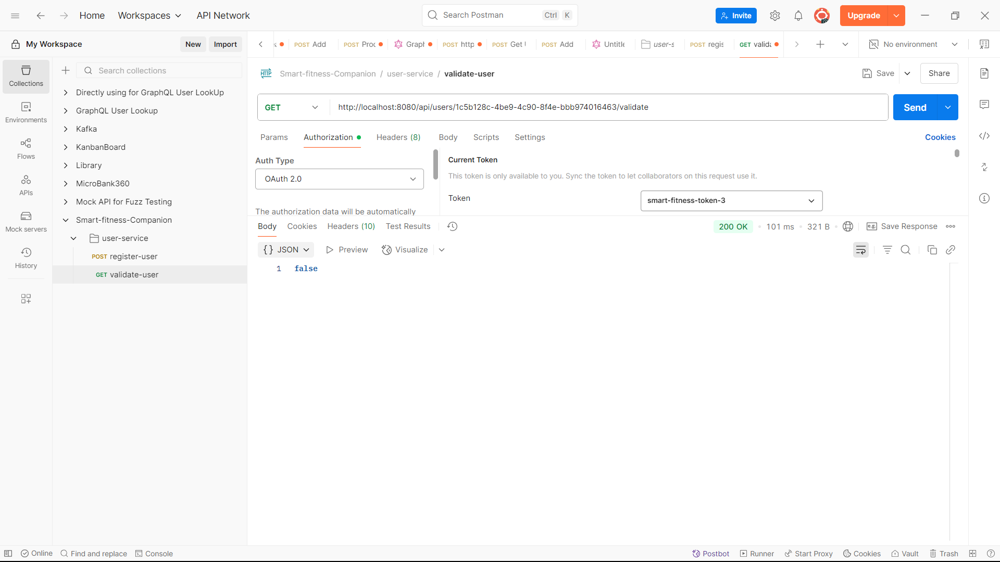
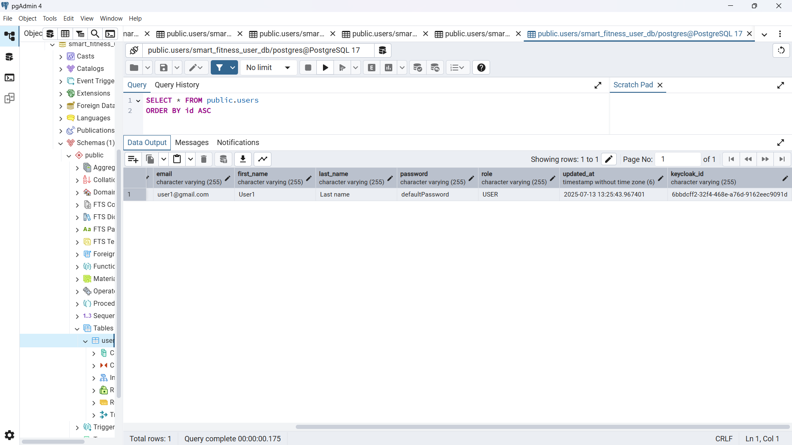
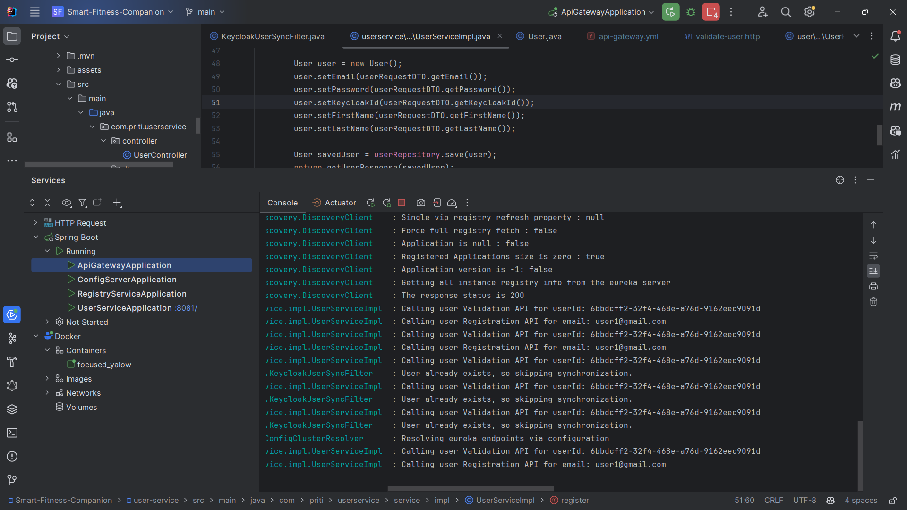


### Validated Scenarios

* Authenticated users successfully access protected APIs
* Unknown Keycloak users auto-registered in `user-service`
* Duplicate calls skip re-registration
* Requests without tokens receive `401 Unauthorized`


### Resulting Architecture

* Unified token-based authentication across services
* Identity centralized in Keycloak, decoupled from microservices
* Stateless user sync ensures minimal duplication
* API Gateway acts as authentication and synchronization layer

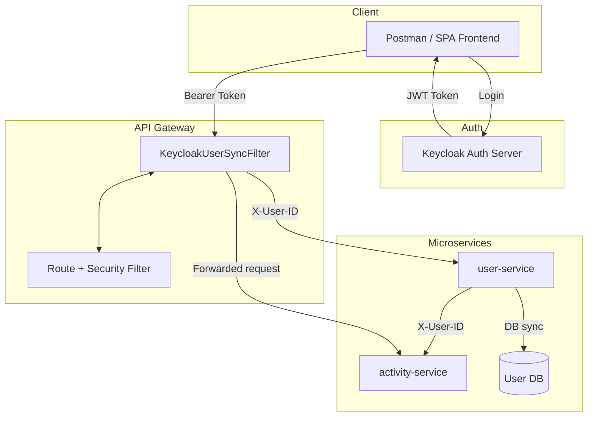
```mermaid
flowchart TD
    subgraph Client
        A[Postman / SPA Frontend]
    end
    subgraph Auth
        B[Keycloak Auth Server]
    end
    subgraph API Gateway
        C[KeycloakUserSyncFilter]<-->D[Route + Security Filter]
    end
    subgraph Microservices
        E[user-service]-->|X-User-ID|F[activity-service]
        E-->|DB sync|DB[(User DB)]
    end

    A-->|Login|B
    B-->|JWT Token|A
    A-->|Bearer Token|C
    C-->|X-User-ID|E
    C-->|Forwarded request|F
```

---


