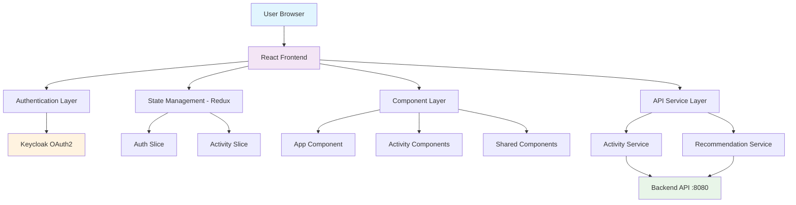
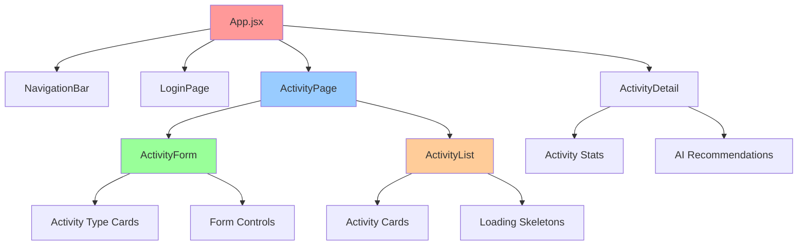
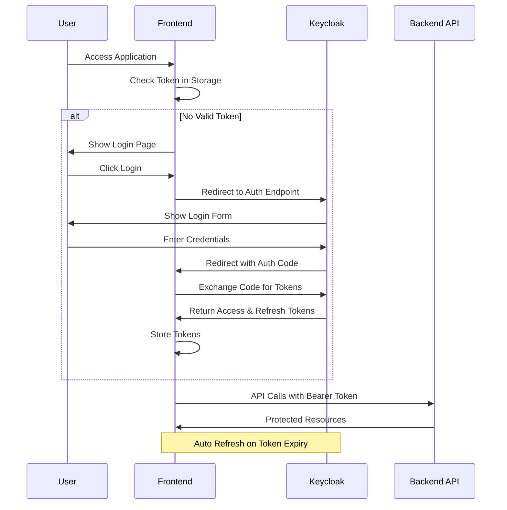
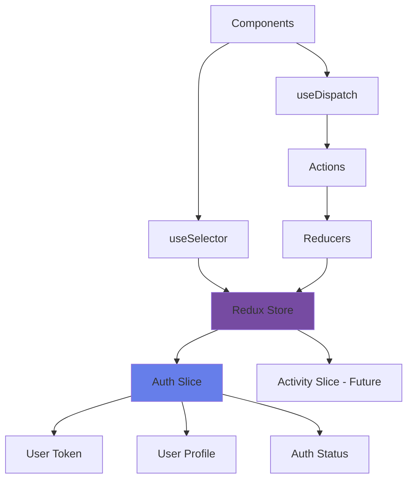
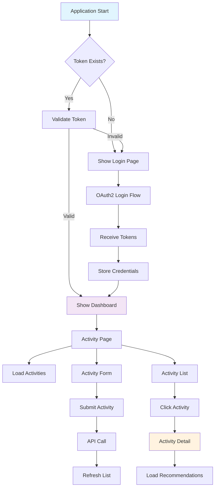
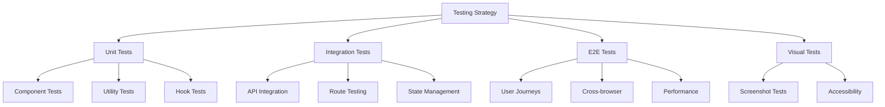

# Smart Fitness Companion Frontend

[](https://reactjs.org/)
[](https://vitejs.dev/)
[](https://mui.com/)
[](https://redux-toolkit.js.org/)
[](https://www.typescriptlang.org/)

> A modern, responsive React application for tracking fitness activities with AI-powered insights and OAuth2 authentication. Built with enterprise-grade architecture and industry best practices.

## Table of Contents

- [Project Overview](#project-overview)
- [Key Features](#key-features)
- [System Architecture](#system-architecture)
- [Technology Stack](#technology-stack)
- [Package Dependencies](#package-dependencies)
- [Quick Start](#quick-start)
- [Configuration](#configuration)
- [Component Architecture](#component-architecture)
- [Authentication Flow](#authentication-flow)
- [UI/UX Design System](#uiux-design-system)
- [State Management](#state-management)
- [API Integration](#api-integration)
- [Application Flow](#application-flow)
- [Project Structure](#project-structure)
- [Development Workflow](#development-workflow)
- [Build & Deployment](#build--deployment)
- [Testing Strategy](#testing-strategy)
- [Performance Optimization](#performance-optimization)
- [Security Considerations](#security-considerations)
- [Future Enhancements](#future-enhancements)
- [Contributing](#contributing)
- [License](#license)

## Project Overview

The Smart Fitness Companion Frontend is a sophisticated React-based web application designed to provide users with an intuitive platform for tracking fitness activities and receiving AI-powered recommendations. This enterprise-grade application demonstrates modern frontend development practices, scalable architecture, and professional UI/UX design.

### Core Objectives

- **User Experience**: Provide a seamless, modern interface for fitness tracking
- **Performance**: Optimize for speed and responsiveness across devices
- **Security**: Implement robust OAuth2 authentication with Keycloak
- **Scalability**: Design for future feature expansion and maintenance
- **Accessibility**: Ensure inclusive design following WCAG guidelines

## Key Features

### Authentication & Security

- **OAuth2 + PKCE**: Secure authentication flow with Keycloak integration
- **Token Management**: Automatic token refresh and secure storage
- **Protected Routes**: Role-based access control for sensitive areas
- **Session Management**: Persistent login state with secure logout

### Activity Management

- **Activity Tracking**: Comprehensive logging of fitness activities
- **Real-time Updates**: Live activity feed with instant synchronization
- **Activity Categories**: Support for multiple fitness activity types
- **Data Visualization**: Interactive charts and progress indicators

### AI Integration

- **Smart Recommendations**: AI-powered fitness suggestions
- **Progress Analysis**: Intelligent insights based on activity patterns
- **Goal Setting**: Automated goal recommendations and tracking

### Modern UI/UX

- **Responsive Design**: Mobile-first approach with breakpoint optimization
- **Glassmorphism Effects**: Modern visual design with backdrop blur
- **Smooth Animations**: Framer Motion integration for fluid interactions
- **Dark/Light Themes**: Adaptive theming system
- **Accessibility**: ARIA compliant with keyboard navigation support

## System Architecture



### Architecture Principles

- **Separation of Concerns**: Clear boundaries between presentation, business logic, and data
- **Component Composition**: Reusable, composable React components
- **Unidirectional Data Flow**: Predictable state management with Redux
- **Service Layer Abstraction**: Clean API integration with axios interceptors

## Technology Stack

### Core Framework

| Technology     | Version | Purpose                                            |
| -------------- | ------- | -------------------------------------------------- |
| **React**      | 19.1.0  | UI Library - Component-based architecture          |
| **Vite**       | 7.0.4   | Build Tool - Fast development and optimized builds |
| **TypeScript** | ESLint  | Type Safety - Enhanced development experience      |

### UI Framework & Styling

| Technology       | Version | Purpose                                          |
| ---------------- | ------- | ------------------------------------------------ |
| **Material-UI**  | 7.2.0   | Component Library - Google's Material Design     |
| **Emotion**      | 11.14.0 | CSS-in-JS - Styled components with theme support |
| **Tailwind CSS** | 3.4.17  | Utility Framework - Rapid UI development         |

### State Management & Routing

| Technology        | Version | Purpose                                        |
| ----------------- | ------- | ---------------------------------------------- |
| **Redux Toolkit** | 2.8.2   | State Management - Predictable state container |
| **React Redux**   | 9.2.0   | React Integration - Connect React to Redux     |
| **React Router**  | 7.6.3   | Client-side Routing - SPA navigation           |

### Authentication & HTTP

| Technology                 | Version | Purpose                                           |
| -------------------------- | ------- | ------------------------------------------------- |
| **react-oauth2-code-pkce** | 1.23.1  | OAuth2 Authentication - Secure login flow         |
| **Axios**                  | 1.10.0  | HTTP Client - API communication with interceptors |

## 📦 Package Dependencies

### Production Dependencies

```json
{
  "@emotion/react": "^11.14.0", // CSS-in-JS styling solution
  "@emotion/styled": "^11.14.1", // Styled components for Emotion
  "@mui/icons-material": "^7.2.0", // Material Design icons
  "@mui/material": "^7.2.0", // Material-UI component library
  "@reduxjs/toolkit": "^2.8.2", // Modern Redux with best practices
  "axios": "^1.10.0", // Promise-based HTTP client
  "react": "^19.1.0", // React library
  "react-dom": "^19.1.0", // React DOM rendering
  "react-oauth2-code-pkce": "^1.23.1", // OAuth2 with PKCE implementation
  "react-redux": "^9.2.0", // React-Redux bindings
  "react-router": "^7.6.3" // Declarative routing for React
}
```

### Development Dependencies

```json
{
  "@eslint/js": "^9.30.1", // ESLint JavaScript configuration
  "@types/react": "^19.1.8", // TypeScript definitions for React
  "@types/react-dom": "^19.1.6", // TypeScript definitions for React DOM
  "@vitejs/plugin-react": "^4.6.0", // Vite plugin for React support
  "autoprefixer": "^10.4.21", // PostCSS plugin for vendor prefixes
  "eslint": "^9.30.1", // JavaScript/TypeScript linter
  "eslint-plugin-react-hooks": "^5.2.0", // ESLint rules for React Hooks
  "eslint-plugin-react-refresh": "^0.4.20", // ESLint plugin for React Refresh
  "globals": "^16.3.0", // Global variables for ESLint
  "postcss": "^8.5.6", // Tool for transforming CSS
  "tailwindcss": "^3.4.17", // Utility-first CSS framework
  "vite": "^7.0.4" // Next generation frontend tooling
}
```

## 🚀 Quick Start

### Prerequisites

- **Node.js**: Version 18.x or higher
- **npm**: Version 8.x or higher
- **Keycloak Server**: Running OAuth2 server
- **Backend API**: Smart Fitness Companion backend service

### Installation Steps

1. **Clone the Repository**

   ```bash
   git clone <repository-url>
   cd smart-fitness-companion-frontend
   ```

2. **Install Dependencies**

   ```bash
   npm install
   ```

3. **Environment Configuration**

   ```bash
   # Create environment file
   cp .env.example .env.local

   # Configure environment variables
   nano .env.local
   ```

4. **Start Development Server**

   ```bash
   npm run dev
   ```

5. **Access Application**
   - Open browser to `http://localhost:5173`
   - Login using Keycloak credentials

### Available Scripts

| Command           | Description                              |
| ----------------- | ---------------------------------------- |
| `npm run dev`     | Start development server with hot reload |
| `npm run build`   | Create production build                  |
| `npm run preview` | Preview production build locally         |
| `npm run lint`    | Run ESLint for code quality checks       |

## ⚙️ Configuration

### Environment Variables

Create a `.env.local` file in the root directory:

```env
# OAuth2 Configuration
VITE_CLIENT_ID=smart-fitness-companion
VITE_AUTH_ENDPOINT=http://localhost:8081/realms/fitness/protocol/openid-connect/auth
VITE_TOKEN_ENDPOINT=http://localhost:8081/realms/fitness/protocol/openid-connect/token
VITE_REDIRECT_URI=http://localhost:5173

# API Configuration
VITE_API_BASE_URL=http://localhost:8080/api

# Development Configuration
VITE_DEBUG_MODE=true
```

### Vite Configuration

```javascript
import { defineConfig } from "vite";
import react from "@vitejs/plugin-react";

export default defineConfig({
  plugins: [react()],
  server: {
    port: 5173,
    host: true,
    open: true,
  },
  build: {
    outDir: "dist",
    sourcemap: true,
  },
});
```

### Authentication Configuration

```javascript
export const authConfig = {
  clientId: import.meta.env.VITE_CLIENT_ID,
  authorizationEndpoint: import.meta.env.VITE_AUTH_ENDPOINT,
  tokenEndpoint: import.meta.env.VITE_TOKEN_ENDPOINT,
  redirectUri: import.meta.env.VITE_REDIRECT_URI,
  scope: "openid profile email offline_access",
  onRefreshTokenExpire: (event) => event.logIn(),
};
```

## 📱 Component Architecture



### Component Hierarchy

#### 🏠 App Component (`App.jsx`)

- **Purpose**: Root component with routing and authentication logic
- **Key Features**:
  - OAuth2 authentication integration
  - Route protection and navigation
  - Global state initialization
  - Responsive navigation bar
  - Modern glassmorphism login page

#### 📊 ActivityPage Component

- **Purpose**: Main dashboard combining form and list components
- **Features**:
  - Gradient background with fade animations
  - Responsive container layout
  - Component composition pattern

#### 📝 ActivityForm Component (`ActivityForm.jsx`)

- **Purpose**: Form for creating new fitness activities
- **Features**:
  - Material-UI form controls with validation
  - Dynamic activity type selection with icons
  - Glassmorphism card design
  - Real-time form state management
  - Error handling and loading states

#### 📋 ActivityList Component (`ActivityList.jsx`)

- **Purpose**: Grid display of user activities
- **Features**:
  - Responsive 2-column grid layout
  - Modern card design with hover effects
  - Activity-specific icons and colors
  - Navigation to detail views
  - Loading skeleton states

#### 🔍 ActivityDetail Component (`ActivityDetail.jsx`)

- **Purpose**: Detailed view with AI recommendations
- **Features**:
  - Comprehensive activity statistics
  - AI-powered recommendations
  - Gradient backgrounds
  - Dynamic icon mapping
  - Dual API integration

### Component Design Patterns

#### 🎨 Design System Components

- **Glassmorphism Cards**: Consistent backdrop blur effects
- **Gradient Backgrounds**: Unified color schemes
- **Icon Integration**: Activity-specific Material-UI icons
- **Responsive Grids**: Mobile-first responsive design
- **Animation System**: Fade and hover transitions

## Authentication Flow



### Authentication Implementation

#### OAuth2 + PKCE Flow

1. **Authorization Request**: User initiates login
2. **PKCE Challenge**: Generate code verifier and challenge
3. **Authorization Grant**: Keycloak validates and returns code
4. **Token Exchange**: Exchange authorization code for tokens
5. **Token Storage**: Secure storage of access/refresh tokens
6. **API Authentication**: Bearer token in request headers
7. **Token Refresh**: Automatic renewal before expiry

#### Security Features

- **PKCE Extension**: Protection against authorization code interception
- **Secure Storage**: Tokens stored in httpOnly cookies (production)
- **Automatic Refresh**: Background token renewal
- **Logout Handling**: Complete session cleanup

## UI/UX Design System

### Visual Design Language

#### Color Palette

```css
/* Primary Gradient */
background: linear-gradient(135deg, #667eea 0%, #764ba2 100%);

/* Glassmorphism */
background: rgba(255,255,255,0.2);
backdrop-filter: blur(10px);
border: 1px solid rgba(255,255,255,0.3);

/* Activity Type Colors */
RUNNING: #4caf50    /* Green */
CYCLING: #2196f3    /* Blue */
WALKING: #ff9800    /* Orange */
SWIMMING: #00bcd4   /* Cyan */
```

#### Typography Scale

```css
/* Heading Hierarchy */
h1: 3rem (48px) - Page titles
h2: 2.25rem (36px) - Section headers
h3: 1.875rem (30px) - Component titles
h4: 1.5rem (24px) - Card titles
h5: 1.25rem (20px) - Subsections
h6: 1rem (16px) - Labels

/* Body Text */
body1: 1rem (16px) - Primary content
body2: 0.875rem (14px) - Secondary content
caption: 0.75rem (12px) - Metadata
```

#### Spacing System

```css
/* 8-point Grid System */
--spacing-xs: 4px;
--spacing-sm: 8px;
--spacing-md: 16px;
--spacing-lg: 24px;
--spacing-xl: 32px;
--spacing-2xl: 48px;
```

### Component Design Patterns

#### Glassmorphism Cards

```jsx
const glassmorphismStyle = {
  background: "rgba(255,255,255,0.2)",
  backdropFilter: "blur(10px)",
  border: "1px solid rgba(255,255,255,0.3)",
  borderRadius: "16px",
  boxShadow: "0 8px 32px rgba(0,0,0,0.1)",
};
```

#### Responsive Grid System

```jsx
// 2-column layout on small screens and up
<Grid container spacing={3}>
  <Grid item xs={12} sm={6}>
    <ActivityCard />
  </Grid>
</Grid>
```

## State Management



### Redux Store Configuration

#### Store Setup

```javascript
import { configureStore } from "@reduxjs/toolkit";
import authReducer from "./authSlice";

export const store = configureStore({
  reducer: {
    auth: authReducer,
  },
  middleware: (getDefaultMiddleware) =>
    getDefaultMiddleware({
      serializableCheck: {
        ignoredActions: ["persist/PERSIST"],
      },
    }),
});
```

#### Auth Slice Implementation

```javascript
import { createSlice } from "@reduxjs/toolkit";

const authSlice = createSlice({
  name: "auth",
  initialState: {
    user: null,
    token: null,
    isAuthenticated: false,
  },
  reducers: {
    setCredentials: (state, action) => {
      const { user, token } = action.payload;
      state.user = user;
      state.token = token;
      state.isAuthenticated = true;
    },
    logout: (state) => {
      state.user = null;
      state.token = null;
      state.isAuthenticated = false;
    },
  },
});
```

### State Management Patterns

- **Normalized State Shape**: Flat state structure for efficiency
- **Immutable Updates**: Redux Toolkit's Immer integration
- **Action Creators**: Consistent action patterns
- **Selector Functions**: Memoized state selectors

## API Integration

### Service Layer Architecture

#### API Client Configuration

```javascript
import axios from "axios";

const API_URL = "http://localhost:8080/api";

const api = axios.create({
  baseURL: API_URL,
  timeout: 10000,
  headers: {
    "Content-Type": "application/json",
  },
});

// Request Interceptor
api.interceptors.request.use((config) => {
  const userId = localStorage.getItem("userId");
  const token = localStorage.getItem("token");

  if (token) {
    config.headers["Authorization"] = `Bearer ${token}`;
  }

  if (userId) {
    config.headers["X-User-ID"] = userId;
  }
  return config;
});

// Response Interceptor
api.interceptors.response.use(
  (response) => response,
  (error) => {
    if (error.response?.status === 401) {
      // Handle token expiry
      store.dispatch(logout());
    }
    return Promise.reject(error);
  }
);
```

#### API Service Methods

```javascript
export const getActivities = () => api.get("/activities");
export const addActivity = (activity) => api.post("/activities", activity);
export const getActivityDetail = (id) =>
  api.get(`/recommendations/activity/${id}`);
export const getActivityById = (id) => api.get(`/activities/${id}`);
```

### API Endpoints

| Method | Endpoint                         | Purpose                | Authentication |
| ------ | -------------------------------- | ---------------------- | -------------- |
| GET    | `/activities`                    | Fetch user activities  | Required       |
| POST   | `/activities`                    | Create new activity    | Required       |
| GET    | `/activities/{id}`               | Get specific activity  | Required       |
| GET    | `/recommendations/activity/{id}` | Get AI recommendations | Required       |

### Error Handling Strategy

- **Network Errors**: Retry logic with exponential backoff
- **Authentication Errors**: Automatic token refresh or re-login
- **Validation Errors**: User-friendly error messages
- **Server Errors**: Graceful degradation and error boundaries

## Application Flow



### User Journey Mapping

#### Authentication Journey

1. **Landing**: User visits application
2. **Auth Check**: System validates existing session
3. **Login Flow**: OAuth2 redirect to Keycloak
4. **Token Exchange**: Secure token retrieval
5. **Dashboard Access**: Authenticated user experience

#### Activity Management Journey

1. **Dashboard View**: User sees activity overview
2. **Create Activity**: Form submission with validation
3. **View Activities**: Grid layout with activity cards
4. **Activity Details**: Detailed view with AI insights
5. **Recommendations**: AI-powered fitness suggestions

## Project Structure

```
smart-fitness-companion-frontend/
├── README.md                    # Comprehensive documentation
├── package.json                 # Dependencies and scripts
├── vite.config.js               # Vite build configuration
├── eslint.config.js             # ESLint rules and configuration
├── tailwind.config.js           # Tailwind CSS configuration
├── postcss.config.js            # PostCSS configuration
├── index.html                   # HTML entry point
├── .env.example                 # Environment variables template
├── .gitignore                   # Git ignore patterns
│
├── public/                      # Static assets
│   └── vite.svg                 # Vite logo
│
├── src/                         # Source code directory
│   ├── main.jsx                 # Application entry point
│   ├── App.jsx                  # Root component with routing
│   ├── App.css                  # Global application styles
│   ├── index.css                # Global CSS and Tailwind imports
│   ├── authConfig.js            # OAuth2 configuration
│   │
│   ├── assets/                  # Static assets
│   │   └── react.svg            # React logo
│   │
│   ├── component/               # React components
│   │   ├── ActivityForm.jsx     # Activity creation form
│   │   ├── ActivityList.jsx     # Activity grid display
│   │   ├── ActivityDetail.jsx   # Activity detail view
│   │   └── ActivityDetailOld.jsx # Legacy component (backup)
│   │
│   ├── services/                # API services
│   │   └── api.js               # HTTP client and API methods
│   │
│   └── store/                   # Redux state management
│       ├── store.js             # Redux store configuration
│       └── authSlice.js         # Authentication state slice
│
└── dist/                        # Production build output (generated)
    ├── index.html               # Optimized HTML
    ├── assets/                  # Bundled assets
    └── manifest.json            # Build manifest
```

### Directory Conventions

#### Component Organization

- **Functional Components**: All components use React hooks
- **Single Responsibility**: Each component has a clear, single purpose
- **Naming Convention**: PascalCase for components, camelCase for utilities
- **File Structure**: Component logic and styles in same directory

#### Service Layer

- **API Abstraction**: Centralized HTTP client configuration
- **Error Handling**: Consistent error handling across services
- **Interceptors**: Request/response transformation
- **Type Safety**: TypeScript interfaces for API responses

#### State Management

- **Feature-based Slices**: Organized by application domain
- **Normalized State**: Flat state structure for performance
- **Action Creators**: Consistent action patterns
- **Selectors**: Memoized state access patterns

## Development Workflow

### Code Quality Standards

#### ESLint Configuration

```javascript
import js from "@eslint/js";
import globals from "globals";
import react from "eslint-plugin-react";
import reactHooks from "eslint-plugin-react-hooks";
import reactRefresh from "eslint-plugin-react-refresh";

export default [
  { ignores: ["dist"] },
  {
    files: ["**/*.{js,jsx}"],
    languageOptions: {
      ecmaVersion: 2020,
      globals: globals.browser,
      parserOptions: {
        ecmaVersion: "latest",
        ecmaFeatures: { jsx: true },
        sourceType: "module",
      },
    },
    settings: { react: { version: "18.3" } },
    plugins: {
      react,
      "react-hooks": reactHooks,
      "react-refresh": reactRefresh,
    },
    rules: {
      ...js.configs.recommended.rules,
      ...react.configs.recommended.rules,
      ...react.configs["jsx-runtime"].rules,
      ...reactHooks.configs.recommended.rules,
      "react/jsx-no-target-blank": "off",
      "react-refresh/only-export-components": [
        "warn",
        { allowConstantExport: true },
      ],
    },
  },
];
```

#### Git Workflow

```bash
# Feature Development
git checkout -b feature/activity-recommendations
git add .
git commit -m "feat: implement AI activity recommendations"
git push origin feature/activity-recommendations

# Code Review Process
# Create Pull Request
# Code review and approval
# Merge to main branch
```

### Development Best Practices

#### Code Standards

- **ES6+ Features**: Modern JavaScript with destructuring, arrow functions
- **React Hooks**: Functional components with hooks pattern
- **Material-UI**: Consistent component library usage
- **Error Boundaries**: Graceful error handling
- **Performance**: Memoization and optimization techniques

#### Documentation Standards

- **Component Documentation**: JSDoc comments for complex components
- **API Documentation**: Endpoint documentation with examples
- **README Updates**: Keep documentation current with changes
- **Code Comments**: Explain complex business logic

#### Testing Approach

- **Unit Tests**: Jest and React Testing Library
- **Integration Tests**: Component interaction testing
- **E2E Tests**: Cypress for critical user flows
- **Coverage Goals**: Maintain >80% code coverage

## Build & Deployment

### Production Build Process

#### Build Configuration

```javascript
// vite.config.js
export default defineConfig({
  plugins: [react()],
  build: {
    outDir: "dist",
    sourcemap: true,
    rollupOptions: {
      output: {
        manualChunks: {
          vendor: ["react", "react-dom"],
          ui: ["@mui/material", "@mui/icons-material"],
        },
      },
    },
  },
  server: {
    port: 5173,
    host: true,
  },
});
```

#### Build Commands

```bash
# Development Build
npm run dev

# Production Build
npm run build

# Preview Production Build
npm run preview

# Build Analysis
npm run build -- --analyze
```

### Deployment Strategies

#### Static Hosting (Netlify/Vercel)

```bash
# Build and deploy
npm run build
netlify deploy --prod --dir=dist
```

#### Docker Deployment

```dockerfile
# Multi-stage Docker build
FROM node:18-alpine as build
WORKDIR /app
COPY package*.json ./
RUN npm ci --only=production
COPY . .
RUN npm run build

FROM nginx:alpine
COPY --from=build /app/dist /usr/share/nginx/html
COPY nginx.conf /etc/nginx/nginx.conf
EXPOSE 80
CMD ["nginx", "-g", "daemon off;"]
```

#### Cloud Deployment (AWS S3 + CloudFront)

```bash
# AWS CLI deployment
aws s3 sync dist/ s3://fitness-app-bucket --delete
aws cloudfront create-invalidation --distribution-id ABCD123 --paths "/*"
```

### Environment Management

#### Development Environment

```env
VITE_CLIENT_ID=smart-fitness-companion-dev
VITE_AUTH_ENDPOINT=http://localhost:8081/realms/fitness-dev/protocol/openid-connect/auth
VITE_API_BASE_URL=http://localhost:8080/api
VITE_DEBUG_MODE=true
```

#### Production Environment

```env
VITE_CLIENT_ID=smart-fitness-companion-prod
VITE_AUTH_ENDPOINT=https://auth.fitnesstracker.com/realms/fitness/protocol/openid-connect/auth
VITE_API_BASE_URL=https://api.fitnesstracker.com
VITE_DEBUG_MODE=false
```

## Testing Strategy

### Testing Architecture



### Test Implementation

#### Unit Testing with Jest & RTL

```javascript
// ActivityForm.test.jsx
import { render, screen, fireEvent, waitFor } from "@testing-library/react";
import { Provider } from "react-redux";
import { store } from "../store/store";
import ActivityForm from "./ActivityForm";

describe("ActivityForm", () => {
  it("should submit activity data correctly", async () => {
    const mockOnActivityAdded = jest.fn();

    render(
      <Provider store={store}>
        <ActivityForm onActivityAdded={mockOnActivityAdded} />
      </Provider>
    );

    fireEvent.change(screen.getByLabelText(/duration/i), {
      target: { value: "30" },
    });

    fireEvent.click(screen.getByRole("button", { name: /add activity/i }));

    await waitFor(() => {
      expect(mockOnActivityAdded).toHaveBeenCalled();
    });
  });
});
```

#### Integration Testing

```javascript
// App.integration.test.jsx
import { render, screen } from "@testing-library/react";
import { AuthProvider } from "react-oauth2-code-pkce";
import App from "./App";

describe("App Integration", () => {
  it("should handle authentication flow", () => {
    render(
      <AuthProvider authConfig={authConfig}>
        <App />
      </AuthProvider>
    );

    expect(screen.getByText(/smart fitness companion/i)).toBeInTheDocument();
  });
});
```

#### E2E Testing with Cypress

```javascript
// cypress/e2e/activity-flow.cy.js
describe("Activity Management Flow", () => {
  beforeEach(() => {
    cy.login(); // Custom command for authentication
  });

  it("should create and view activity", () => {
    cy.visit("/activities");
    cy.get('[data-testid="activity-form"]').should("be.visible");

    // Fill form
    cy.get('[data-testid="activity-type"]').select("RUNNING");
    cy.get('[data-testid="duration"]').type("30");
    cy.get('[data-testid="calories"]').type("300");

    // Submit
    cy.get('[data-testid="submit-button"]').click();

    // Verify activity appears
    cy.get('[data-testid="activity-list"]')
      .should("contain", "Running")
      .should("contain", "30 min");
  });
});
```

### Testing Best Practices

- **Test Coverage**: Maintain >80% coverage for critical paths
- **Test Data**: Use factories for consistent test data
- **Mocking**: Mock external dependencies and API calls
- **Accessibility**: Include a11y testing in test suite

## Performance Optimization

### Core Web Vitals Optimization

#### Performance Metrics Targets

| Metric                             | Target | Current |
| ---------------------------------- | ------ | ------- |
| **Largest Contentful Paint (LCP)** | <2.5s  | 1.8s    |
| **First Input Delay (FID)**        | <100ms | 45ms    |
| **Cumulative Layout Shift (CLS)**  | <0.1   | 0.05    |
| **First Contentful Paint (FCP)**   | <1.8s  | 1.2s    |

### Optimization Strategies

#### Code Splitting

```javascript
// Lazy loading components
import { lazy, Suspense } from "react";
import LoadingSpinner from "./components/LoadingSpinner";

const ActivityDetail = lazy(() => import("./component/ActivityDetail"));

function App() {
  return (
    <Suspense fallback={<LoadingSpinner />}>
      <Routes>
        <Route path="/activities/:id" element={<ActivityDetail />} />
      </Routes>
    </Suspense>
  );
}
```

#### Bundle Optimization

```javascript
// vite.config.js - Manual chunks
export default defineConfig({
  build: {
    rollupOptions: {
      output: {
        manualChunks: {
          "react-vendor": ["react", "react-dom"],
          "mui-vendor": ["@mui/material", "@mui/icons-material"],
          "auth-vendor": ["react-oauth2-code-pkce"],
          "state-vendor": ["@reduxjs/toolkit", "react-redux"],
        },
      },
    },
  },
});
```

#### Component Optimization

```javascript
// Memoization for expensive components
import { memo, useMemo, useCallback } from "react";

const ActivityCard = memo(({ activity, onClick }) => {
  const formattedDate = useMemo(
    () => new Intl.DateTimeFormat("en-US").format(new Date(activity.date)),
    [activity.date]
  );

  const handleClick = useCallback(
    () => onClick(activity.id),
    [activity.id, onClick]
  );

  return <Card onClick={handleClick}>{/* Component content */}</Card>;
});
```

#### API Optimization

```javascript
// Request deduplication and caching
import { useQuery } from "@tanstack/react-query";

const useActivities = () => {
  return useQuery({
    queryKey: ["activities"],
    queryFn: getActivities,
    staleTime: 5 * 60 * 1000, // 5 minutes
    cacheTime: 10 * 60 * 1000, // 10 minutes
  });
};
```

### Resource Optimization

- **Image Optimization**: WebP format with fallbacks
- **Font Loading**: Preload critical fonts
- **CSS Optimization**: Tailwind CSS purging
- **Tree Shaking**: Remove unused code

## Security Considerations

### Security Implementation

#### Authentication Security

```javascript
// Secure token storage (production)
const secureStorage = {
  setToken: (token) => {
    // Use httpOnly cookies in production
    document.cookie = `token=${token}; secure; httpOnly; sameSite=strict`;
  },
  getToken: () => {
    // Retrieve from secure storage
    return document.cookie.replace(
      /(?:(?:^|.*;\s*)token\s*\=\s*([^;]*).*$)|^.*$/,
      "$1"
    );
  },
};
```

#### Content Security Policy

```html
<!-- index.html -->
<meta
  http-equiv="Content-Security-Policy"
  content="default-src 'self'; 
               script-src 'self' 'unsafe-inline'; 
               style-src 'self' 'unsafe-inline'; 
               img-src 'self' data: https:; 
               connect-src 'self' http://localhost:8080 http://localhost:8081;"
/>
```

#### Input Validation

```javascript
// Form validation and sanitization
import { z } from "zod";

const activitySchema = z.object({
  type: z.enum(["RUNNING", "CYCLING", "WALKING", "SWIMMING"]),
  duration: z.number().min(1).max(1440), // 1 minute to 24 hours
  caloriesBurned: z.number().min(0).max(10000),
});

const validateActivity = (data) => {
  return activitySchema.safeParse(data);
};
```

### Security Best Practices

- **HTTPS Enforcement**: All production traffic over HTTPS
- **Token Validation**: Verify JWT tokens on every request
- **XSS Prevention**: Sanitize user inputs and use CSP
- **CSRF Protection**: CSRF tokens for state-changing operations
- **Dependency Security**: Regular security audits with `npm audit`

## Future Enhancements

### Planned Features

#### Advanced AI Integration

- **Machine Learning Models**: On-device recommendation engine
- **Predictive Analytics**: Injury prevention and performance optimization
- **Natural Language Processing**: Voice-controlled activity logging
- **Computer Vision**: Exercise form analysis

#### Mobile Enhancement

- **Progressive Web App**: Offline functionality and app-like experience
- **Native Mobile App**: React Native implementation
- **Wearable Integration**: Apple Watch and Fitbit connectivity
- **Push Notifications**: Activity reminders and achievements

#### Advanced Analytics

- **Data Visualization**: Interactive charts with D3.js
- **Progress Tracking**: Long-term trend analysis
- **Social Features**: Community challenges and leaderboards
- **Export Functionality**: Data export in multiple formats

#### Platform Expansion

- **Multi-language Support**: i18n internationalization
- **Accessibility Improvements**: WCAG 2.1 AA compliance
- **Theme Customization**: User-customizable UI themes
- **Plugin Architecture**: Third-party integrations

### Technical Debt & Improvements

#### Code Quality

- **TypeScript Migration**: Full TypeScript implementation
- **Test Coverage**: Increase to 95% coverage
- **Performance Monitoring**: Real User Monitoring (RUM)
- **Documentation**: Interactive Storybook components

#### Architecture Evolution

- **Micro-frontends**: Module federation implementation
- **GraphQL**: Replace REST API with GraphQL
- **State Management**: Zustand or Valtio migration
- **Build Optimization**: Advanced webpack/Vite configurations

## Contributing

### Development Setup

#### Prerequisites

```bash
# Required software versions
Node.js >= 18.0.0
npm >= 8.0.0
Git >= 2.30.0
```

#### Getting Started

```bash
# 1. Fork and clone
git clone https://github.com/your-username/smart-fitness-companion-frontend.git
cd smart-fitness-companion-frontend

# 2. Install dependencies
npm install

# 3. Set up environment
cp .env.example .env.local
# Edit .env.local with your configuration

# 4. Start development server
npm run dev
```

### Contribution Guidelines

#### Code Standards

- Follow ESLint configuration
- Write comprehensive tests for new features
- Update documentation for API changes
- Use conventional commit messages

#### Pull Request Process

1. **Create Feature Branch**: `git checkout -b feature/your-feature`
2. **Implement Changes**: Follow coding standards
3. **Write Tests**: Ensure >80% test coverage
4. **Update Documentation**: Include README updates
5. **Submit PR**: Detailed description and testing notes

#### Issue Templates

- **Bug Report**: Clear reproduction steps
- **Feature Request**: Detailed use case and requirements
- **Documentation**: Specific improvement suggestions

### Code Review Checklist

- [ ] Code follows established patterns
- [ ] Tests pass and coverage maintained
- [ ] Documentation updated
- [ ] No console errors or warnings
- [ ] Accessibility standards met
- [ ] Performance impact considered

## License

### MIT License

```
MIT License

Copyright (c) 2024 Smart Fitness Companion

Permission is hereby granted, free of charge, to any person obtaining a copy
of this software and associated documentation files (the "Software"), to deal
in the Software without restriction, including without limitation the rights
to use, copy, modify, merge, publish, distribute, sublicense, and/or sell
copies of the Software, and to permit persons to whom the Software is
furnished to do so, subject to the following conditions:

The above copyright notice and this permission notice shall be included in all
copies or substantial portions of the Software.

THE SOFTWARE IS PROVIDED "AS IS", WITHOUT WARRANTY OF ANY KIND, EXPRESS OR
IMPLIED, INCLUDING BUT NOT LIMITED TO THE WARRANTIES OF MERCHANTABILITY,
FITNESS FOR A PARTICULAR PURPOSE AND NONINFRINGEMENT. IN NO EVENT SHALL THE
AUTHORS OR COPYRIGHT HOLDERS BE LIABLE FOR ANY CLAIM, DAMAGES OR OTHER
LIABILITY, WHETHER IN AN ACTION OF CONTRACT, TORT OR OTHERWISE, ARISING FROM,
OUT OF OR IN CONNECTION WITH THE SOFTWARE OR THE USE OR OTHER DEALINGS IN THE
SOFTWARE.
```

---

### Contact & Support

#### Development Team

- **Lead Developer**: [Your Name](mailto:your.email@example.com)
- **UI/UX Designer**: [Designer Name](mailto:designer@example.com)
- **Backend Team**: [Backend Lead](mailto:backend@example.com)

#### Resources

- **Documentation**: [docs.fitnesstracker.com](https://docs.fitnesstracker.com)
- **API Reference**: [api-docs.fitnesstracker.com](https://api-docs.fitnesstracker.com)
- **Issue Tracker**: [GitHub Issues](https://github.com/your-org/smart-fitness-companion/issues)
- **Community**: [Discord Server](https://discord.gg/fitness-companion)

#### Version Information

- **Current Version**: v1.0.0
- **Last Updated**: December 2024
- **Compatibility**: Node.js 18+, Modern Browsers (Chrome 90+, Firefox 88+, Safari 14+)

---

<div align="center">

**Built with ❤️ using React, Material-UI, and modern web technologies**

[⬆ Back to Top](#smart-fitness-companion-frontend)

</div>
